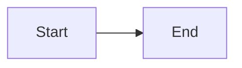

# Transform Platform — Docs Site

This directory contains the [Docusaurus 3](https://docusaurus.io/) source for the Transform Platform documentation.

**Live site:** https://avinashreddyoceans.github.io/transform-platform/

---

## Running Locally

### Prerequisites

- **Node.js 20** (LTS) — this project requires Node ≥ 18. A `.nvmrc` file pins it to 20.
- **npm 9+** — bundled with Node 20

#### Check your Node version

```bash
node --version
```

If you see `v16.x` or lower, you need to upgrade. We recommend using **nvm** (Node Version Manager).

---

### Setting Up Node.js with nvm

#### 1. Install nvm (if not already installed)

```bash
curl -o- https://raw.githubusercontent.com/nvm-sh/nvm/v0.39.7/install.sh | bash
```

#### 2. Source nvm in your shell (fix "zsh: command not found: nvm")

After installation, nvm needs to be loaded into your shell session. Add these lines to your `~/.zshrc` (for zsh) or `~/.bashrc` (for bash):

```bash
export NVM_DIR="$HOME/.nvm"
[ -s "$NVM_DIR/nvm.sh" ] && \. "$NVM_DIR/nvm.sh"
[ -s "$NVM_DIR/bash_completion" ] && \. "$NVM_DIR/bash_completion"
```

Then reload your shell:

```bash
source ~/.zshrc   # or source ~/.bashrc
```

#### 3. Install and use Node 20

The `.nvmrc` file in this directory pins Node to version 20. From inside `website/`:

```bash
nvm install    # reads .nvmrc → installs Node 20 if needed
nvm use        # switches to Node 20 for this session
node --version # should print v20.x.x
```

> **Tip:** To make Node 20 your default, run `nvm alias default 20`.

---

### Install Dependencies

```bash
cd website
npm install
```

### Start the Dev Server

```bash
npm start
```

This opens your browser at **http://localhost:3000/transform-platform/** with hot-reload enabled. Edit any `.md` file under `docs/` and the page refreshes instantly — no restart needed.

### Production Build (optional)

```bash
npm run build
```

Output is written to `website/build/`. Preview it locally with:

```bash
npm run serve
```

This serves the production build at **http://localhost:3000/transform-platform/**.

---

## Project Structure

```
website/
├── docs/                    # Markdown source — edit these
│   ├── intro.md
│   ├── getting-started.md
│   ├── architecture.md
│   ├── api-reference.md
│   ├── tech-stack.md
│   ├── developer-setup.md   # Local dev guide
│   ├── modules/
│   ├── integration/
│   ├── extending/
│   └── contributing/
├── src/
│   └── css/custom.css       # Theme overrides
├── static/
│   └── img/logo.svg
├── .nvmrc                   # Pins Node version to 20
├── docusaurus.config.ts     # Site config (title, URL, navbar, Mermaid)
├── sidebars.ts              # Left-nav structure
└── package.json
```

## Mermaid Diagrams

Mermaid is enabled globally. Use fenced code blocks with the `mermaid` language tag anywhere in your markdown:

````md

````

Diagrams automatically adapt to light/dark mode.

---

## Deployment

Docs are deployed automatically by GitHub Actions (`.github/workflows/docs.yml`) whenever changes to `website/**` are pushed to `main`. The workflow builds Docusaurus using GitHub Actions native Pages deployment — no build artifacts are ever committed to the repo.

To deploy manually, push any change to `website/` on `main`, or trigger the **Deploy Docs** workflow from the GitHub Actions tab.
