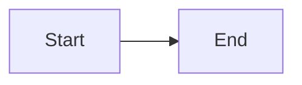

# Transform Platform — Docs Site

This directory contains the [Docusaurus 3](https://docusaurus.io/) source for the Transform Platform documentation.

**Live site:** https://avinashreddyoceans.github.io/transform-platform/

---

## Running Locally

### Prerequisites

- **Node.js 18+** — check with `node --version`
- **npm 9+** — check with `npm --version`

### 1. Install dependencies

```bash
cd website
npm install
```

### 2. Start the dev server

```bash
npm start
```

This opens your browser at **http://localhost:3000/transform-platform/** with hot-reload enabled. Edit any `.md` file under `docs/` and the page refreshes instantly.

### 3. Production build (optional)

```bash
npm run build
```

Output is written to `website/build/`. Inspect it locally with:

```bash
npm run serve
```

This serves the production build at **http://localhost:3000/transform-platform/**.

---

## Project Structure

```
website/
├── docs/                    # Markdown source — edit these
│   ├── intro.md
│   ├── getting-started.md
│   ├── architecture.md
│   ├── api-reference.md
│   ├── tech-stack.md
│   ├── modules/
│   ├── extending/
│   └── contributing/
├── src/
│   └── css/custom.css       # Theme overrides
├── static/
│   └── img/logo.svg
├── docusaurus.config.ts     # Site config (title, URL, navbar, Mermaid)
├── sidebars.ts              # Left-nav structure
└── package.json
```

## Mermaid Diagrams

Mermaid is enabled globally. Use fenced code blocks with the `mermaid` language tag anywhere in your markdown:

````md

````

Diagrams automatically adapt to light/dark mode.

---

## Deployment

Docs are deployed automatically by GitHub Actions (`.github/workflows/docs.yml`) whenever changes to `website/**` are pushed to `main`. The workflow builds Docusaurus and commits the static output to the `docs/` folder, which GitHub Pages serves.

To deploy manually, push any change to `website/` on `main`, or trigger the **Deploy Docs** workflow from the GitHub Actions tab.
