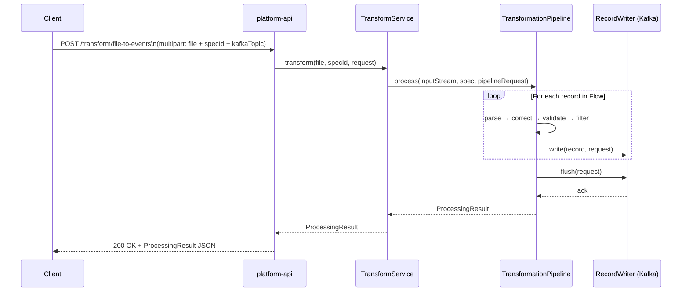

# API Reference

The full interactive API is available at `http://localhost:8080/swagger-ui` when running locally.

## Request Lifecycle



## Spec Management

### Create a Spec

```http
POST /api/v1/specs
Content-Type: application/json
```

**Request body:**

```json
{
  "name": "Bank Transactions CSV",
  "format": "CSV",
  "hasHeader": true,
  "delimiter": ",",
  "fields": [
    {
      "name": "accountNumber",
      "type": "STRING",
      "columnName": "account_number",
      "sensitive": true
    },
    {
      "name": "amount",
      "type": "DECIMAL",
      "columnName": "amount"
    },
    {
      "name": "transactionDate",
      "type": "DATE",
      "columnName": "date",
      "format": "yyyy-MM-dd"
    },
    {
      "name": "description",
      "type": "STRING",
      "columnName": "description",
      "required": false
    }
  ],
  "correctionRules": [
    {
      "ruleId": "trim-desc",
      "field": "description",
      "correctionType": "TRIM"
    }
  ],
  "validationRules": [
    {
      "ruleId": "amount-positive",
      "field": "amount",
      "ruleType": "MIN_VALUE",
      "value": "0",
      "message": "Amount must be positive",
      "severity": "ERROR"
    }
  ]
}
```

**Response:** `201 Created` with the created spec including its `id`.

### List Specs

```http
GET /api/v1/specs
```

**Response:** `200 OK` — array of all registered specs.

### Get Spec

```http
GET /api/v1/specs/{id}
```

**Response:** `200 OK` — the spec, or `404` if not found.

### Delete Spec

```http
DELETE /api/v1/specs/{id}
```

**Response:** `204 No Content`

---

## Transform Operations

### File → Events (Kafka)

Parse a file and publish each record as a Kafka message.

```http
POST /api/v1/transform/file-to-events
Content-Type: multipart/form-data
```

| Field | Type | Description |
|-------|------|-------------|
| `file` | File | The file to transform |
| `specId` | String (UUID) | ID of the registered `FileSpec` |
| `kafkaTopic` | String | Kafka topic to publish records to |
| `skipInvalidRecords` | Boolean | Skip records with errors (default: `false`) |

**Response:**

```json
{
  "status": "SUCCESS",
  "totalRecords": 1000,
  "processedRecords": 998,
  "failedRecords": 2,
  "skippedRecords": 0,
  "durationMs": 342
}
```

### Validate File (Dry Run)

Parse and validate without writing to any destination.

```http
POST /api/v1/transform/validate
Content-Type: multipart/form-data
```

| Field | Type | Description |
|-------|------|-------------|
| `file` | File | The file to validate |
| `specId` | String (UUID) | ID of the registered `FileSpec` |

**Response:** Same `ProcessingResult` shape, with errors for each invalid record included.

---

## Field Types

| Type | Description | Example value |
|------|-------------|---------------|
| `STRING` | Plain text | `"John Doe"` |
| `INTEGER` | Whole number | `42` |
| `DECIMAL` | Decimal number | `10.50` |
| `DATE` | Date with optional format | `"2024-01-15"` |
| `BOOLEAN` | True/false | `true` |

## Correction Types

| Type | Description |
|------|-------------|
| `TRIM` | Remove leading/trailing whitespace |
| `PAD_LEFT` | Left-pad with a character to a target length |
| `PAD_RIGHT` | Right-pad with a character to a target length |
| `UPPER_CASE` | Convert to uppercase |
| `LOWER_CASE` | Convert to lowercase |
| `REGEX_REPLACE` | Replace regex match with a replacement string |
| `COERCE_DATE` | Parse date with a source format, reformat to target |
| `DEFAULT_IF_NULL` | Replace null/blank with a default value |

## Validation Rule Types

| Type | Description |
|------|-------------|
| `REQUIRED` | Field must be non-null and non-empty |
| `MIN_VALUE` | Numeric value must be ≥ `value` |
| `MAX_VALUE` | Numeric value must be ≤ `value` |
| `REGEX` | Field must match the regex in `value` |
| `MIN_LENGTH` | String length must be ≥ `value` |
| `MAX_LENGTH` | String length must be ≤ `value` |
| `DATE_RANGE` | Date must be within the specified range |
| `ALLOWED_VALUES` | Field must be one of the comma-separated `value` list |

## Severity Levels

| Level | Pipeline behaviour |
|-------|-------------------|
| `WARNING` | Attached to record; never causes skipping |
| `ERROR` | Attached to record; causes skip if `skipInvalidRecords=true` |
| `FATAL` | Record is always skipped; increments `failedRecords` |

---

## Window Management

### Open a PENDING Window Manually

Transitions a PENDING window to OPEN without waiting for a scheduler trigger. Useful for ad-hoc testing and operational overrides.

```http
POST /api/windows/{id}/open
```

**Response `200 OK`:**

```json
{
  "windowId": "7d572524-aa01-484f-b7c8-ce39a83cf276",
  "status": "OPEN",
  "openedAt": "2026-03-23T14:26:57.950801Z",
  "profileId": "b005ed80-f28c-41f4-852b-a76bb2a7bb44"
}
```

### Submit a File to a Window

Submits a file to an OPEN window. The file is stored in MinIO, a `FileLog` entry is created, and the window's close trigger is evaluated. If the trigger fires, the configured `ON_FILE_ARRIVED` workflow executes.

```http
POST /api/windows/{windowId}/submit-file
Content-Type: multipart/form-data
```

| Field | Type | Required | Description |
|-------|------|----------|-------------|
| `file` | File part | ✅ | The file content to submit |
| `integrationId` | String | ❌ | Integration ID to tag on the file handle |

**Response `200 OK`:**

```json
{
  "fileLogId": "787b4dea-20dc-45bd-9455-b644f99c9159",
  "windowId": "7d572524-aa01-484f-b7c8-ce39a83cf276",
  "fileName": "camt053_sample_file.xml",
  "matched": true,
  "recordsProcessed": 14,
  "message": "Window closed successfully after processing 14 record(s)"
}
```

| Field | Description |
|-------|-------------|
| `matched` | Whether the file matched the window's close trigger |
| `recordsProcessed` | Total records parsed and published to Kafka |
| `message` | Human-readable summary of what happened |

---

## Workflow Executions

Each time an action runs (triggered by a file arrival or window close), a `WorkflowExecution` record is created. These endpoints let you query execution history.

### List Executions for a Window

```http
GET /api/windows/{windowId}/executions
```

**Response `200 OK`:** Array of execution summaries.

### Get Execution Detail

```http
GET /api/executions/{id}
```

Returns the full execution record including all step-level details (records processed, error messages, duration per step).

**Response `200 OK`:**

```json
{
  "id": "0a50e209-a512-4ce7-9f22-48c381d2b10a",
  "windowInstanceId": "7d572524-...",
  "actionName": "Parse CAMT.053 and forward to Kafka",
  "status": "COMPLETED",
  "totalRecordsProcessed": 14,
  "durationMs": 757,
  "stepExecutions": [
    {
      "stepName": "Parse CAMT053",
      "status": "COMPLETED",
      "recordsProcessed": 14,
      "outputSummary": "14/14 records parsed from camt053_sample_file.xml → topic=bank.statement.entries (failed=0)"
    }
  ]
}
```

### List All Executions

```http
GET /api/executions?status=COMPLETED&limit=100
```

| Param | Default | Description |
|-------|---------|-------------|
| `status` | — | Filter by status: `RUNNING`, `COMPLETED`, `COMPLETED_WITH_ERRORS`, `FAILED` |
| `limit` | `100` | Maximum number of results |

### List Executions for a Profile

```http
GET /api/profiles/{profileId}/executions?limit=50
```

---

## File Logs

### List Files for a Window

```http
GET /api/windows/{windowId}/files
```

Returns all `FileLog` entries submitted to a specific window.

### List All Inbound/Outbound Files

```http
GET /api/files?direction=INBOUND&limit=100
```

| Param | Description |
|-------|-------------|
| `direction` | `INBOUND` or `OUTBOUND` |
| `limit` | Max results (default: `100`) |
