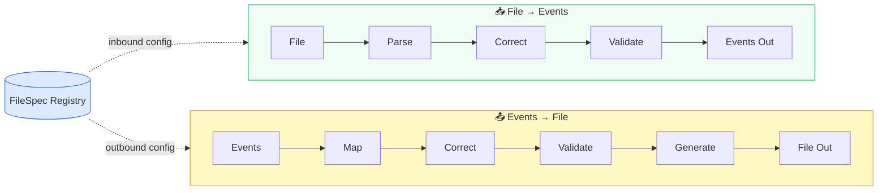
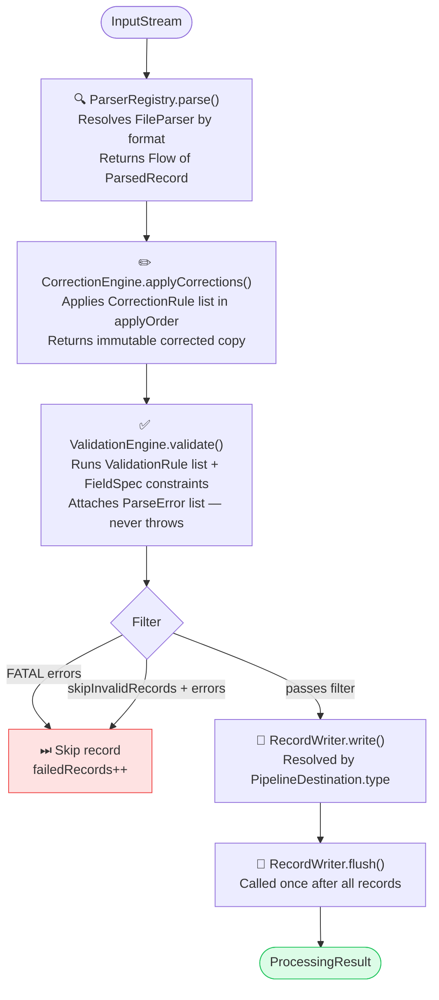
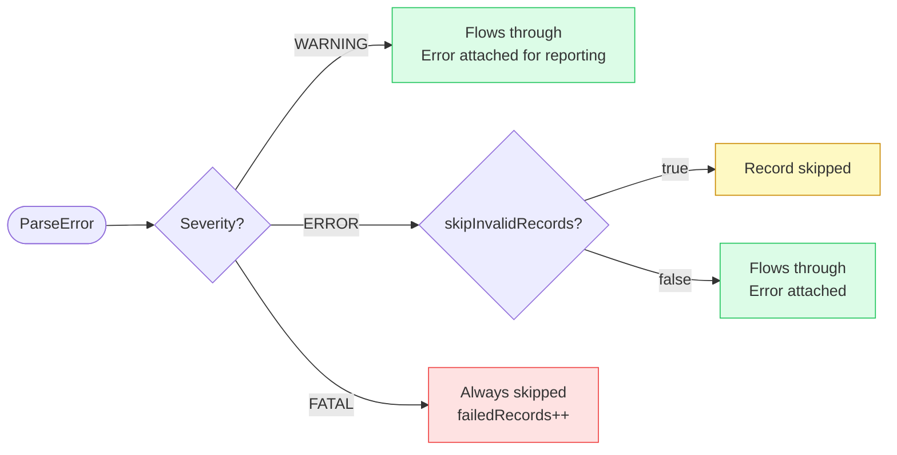
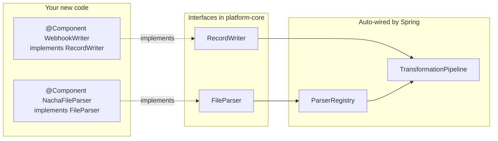

# Architecture

## High-Level Data Flow

The platform is bidirectional. **One `FileSpec`** in the registry drives both directions — it is the single source of truth for parsing, correction, validation, and file generation.

`FileSpec` has two optional sections: the existing inbound fields/rules, and a new `outbound: OutboundConfig` block. A spec can be inbound-only, outbound-only, or fully bidirectional — with zero code changes. See [Events → File Pipeline](./events-to-file) for the full design.

## Transformation Pipeline (Detail)

Each record flows through five deterministic stages. No stage throws — errors accumulate on the record.

## Error Severity Routing

## Open/Closed Extension Model

Add a parser or writer by implementing one interface + `@Component`. Spring discovers it automatically — zero changes to `ParserRegistry` or `TransformationPipeline`.

## Key Classes

| Class | Package | Role |
|-------|---------|------|
| `FileSpec` | `core.spec.model` | Root spec — drives everything |
| `ParsedRecord` | `core.spec.model` | Universal record flowing through the pipeline |
| `ParserRegistry` | `core.spec.registry` | Auto-discovers parsers and routes by format |
| `TransformationPipeline` | `core.pipeline` | Orchestrates the full flow |
| `CorrectionEngine` | `core.transformers` | Applies the `CorrectionRule` list |
| `ValidationEngine` | `core.validators` | Applies the `ValidationRule` list |
| `KafkaRecordWriter` | `core.writers` | Writes `ParsedRecord` → Kafka as JSON |
| `TransformService` | `api.service` | Bridge: HTTP request → pipeline |
| `SpecService` | `api.service` | In-memory spec store (replace with JPA for production) |
| `OutboundConfig` | `core.spec.model` | Outbound section of FileSpec — field mappings, generator format, rules |
| `EventMapper` | `core.transformers` | Projects ParsedRecord → FileRecord using FieldMapping list |
| `FileGenerator` | `core.generators` | Interface for file format writers (NACHA, CSV, SWIFT…) |
| `GeneratorRegistry` | `core.generators` | Auto-discovers @Component FileGenerator beans |
| `EventToFilePipeline` | `core.pipeline` | Orchestrates map → correct → validate → generate |
