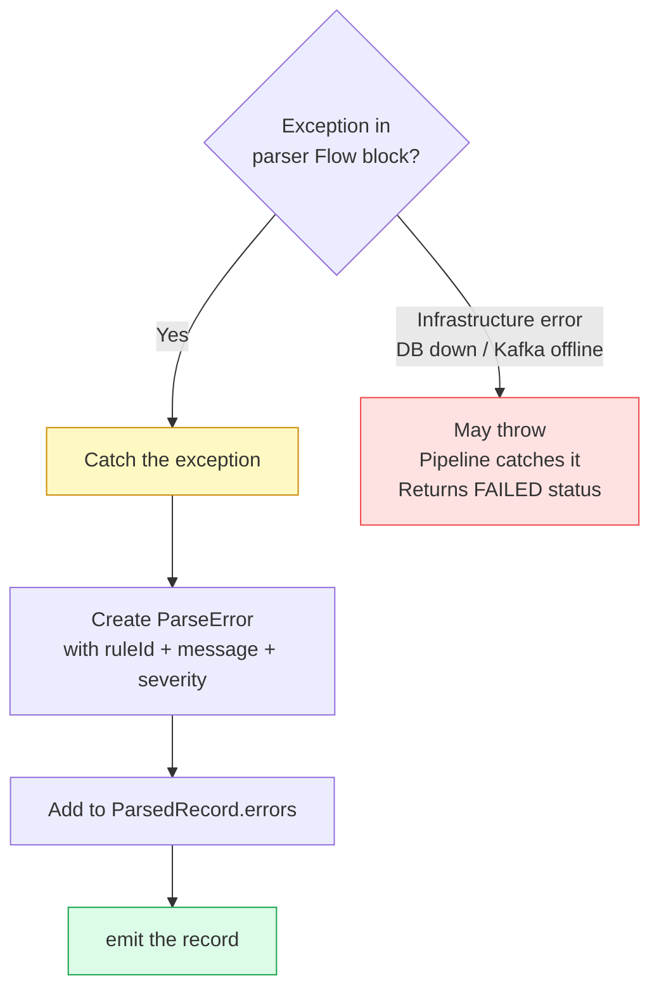
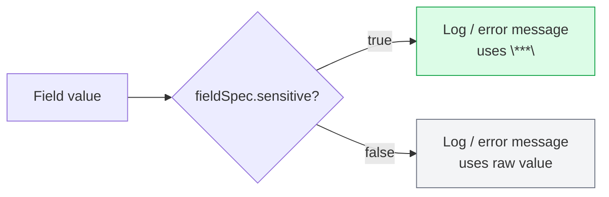
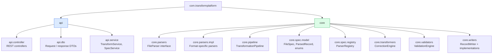

# Code Conventions

## Error Handling in Parsers

:::danger
Never throw inside a `Flow { }` block in a parser. Exceptions inside a flow create uncollectable flows and break the entire stream.
:::

## Sensitive Data Masking

Always check `fieldSpec.sensitive` before including a value in any log or error message. Use `"***"` as the placeholder.

## Kotlin Style

- **Data classes for all models** — keep them immutable; use `.copy()` for mutations
- **Logging** — `private val log = KotlinLogging.logger {}` at file level, not class level
- **Beans** — `@Component` only; no manual `@Bean` factory methods unless unavoidable
- **Coroutines** — `suspend fun` for I/O, `Flow<T>` for streams; never `runBlocking` in production paths
- **Strings** — use string templates over concatenation
- **Named arguments** — required for data class constructors with more than 3 parameters

## Package Structure

## What NOT To Do

| Do not | Reason |
|--------|--------|
| Add `flyway-database-postgresql` dependency | Does not exist in Flyway 9.x (Boot 3.2.3 BOM) |
| Enable `bootJar` on `platform-pipeline` or `platform-scheduler` | No main class — will fail build |
| Load an entire file into a `List` in a parser | Breaks stream-first design; use `Flow` and `emit` |
| Log raw values for `sensitive=true` fields | PII leak; always mask with `***` |
| Throw exceptions inside `Flow { }` blocks | Creates uncollectable flow; add `ParseError` to record instead |
| Commit a filled `.env` file | Gitignored for a reason — use `env.example` as reference |
| Use JUnit test classes | Project is Kotest-only; JUnit Vintage is excluded |
| Modify `ParserRegistry` to hard-code a new parser | Breaks Open/Closed; annotate the new parser `@Component` |
