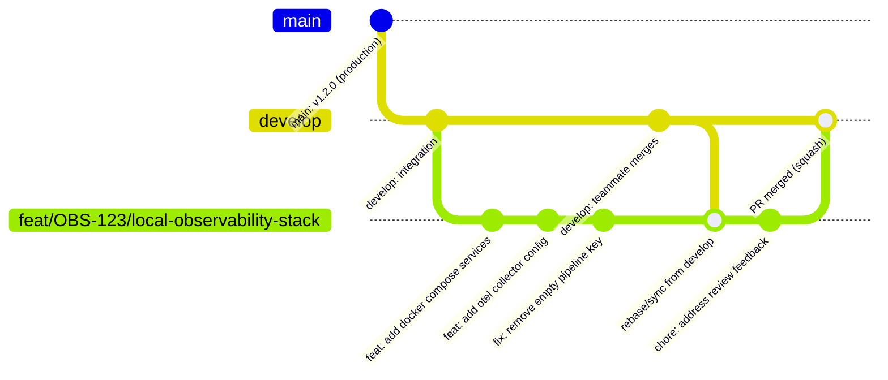
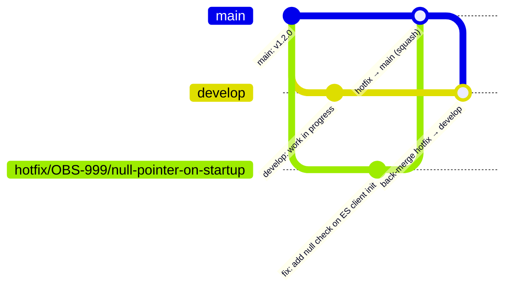

# PR Best Practices — Team Guide

> A living reference for branch naming, commit messages, PR hygiene, and review quality.
> Raise a PR against this file if you think something should change.

---

## Table of contents

1. [Why this matters](#why-this-matters)
2. [Branch naming](#branch-naming)
3. [Daily git workflow](#daily-git-workflow)
4. [Commit messages](#commit-messages)
5. [PR size and focus](#pr-size-and-focus)
6. [PR template guide](#pr-template-guide)
7. [Review comment labels](#review-comment-labels)
8. [Team agreements](#team-agreements)
9. [Cheat sheet](#cheat-sheet)

---

## Why this matters

Every hour a PR sits unreviewed is an hour of blocked work. Every vague description is a back-and-forth thread that didn't need to happen. Every unlabelled review comment is a merge anxiety that didn't need to exist.

Bad PRs compound:
- Reviewers skim instead of read → bugs slip through
- Authors guess at feedback intent → wrong fixes, re-reviews
- No description → next developer can't understand why a change exists → tech debt

Good PRs are a form of documentation. They tell a story: what was broken, why, and how it was fixed. That story lives in your git history forever.

---

## Branch naming

### Convention

```
type/JIRA-TICKET/short-description
```

### Base branch rules

| Branch type | Created from | Merges into |
|---|---|---|
| `feat`, `fix`, `chore`, `docs`, `refactor`, `test` | `develop` | `develop` |
| `hotfix` | `main` | `main` **and** `develop` |

`develop` is the integration branch where all daily work lands. `main` is production-stable and only receives hotfix PRs and planned release merges from `develop`.

### Types

| Type | When to use |
|---|---|
| `feat` | New feature or capability |
| `fix` | Bug fix |
| `chore` | Dependency update, config change, tooling |
| `docs` | Documentation only |
| `refactor` | Code restructure with no behaviour change |
| `test` | Adding or fixing tests only |
| `hotfix` | Critical production fix — branches from `main`, not `develop` |

### Examples

```bash
# ✅ Good — regular branches off develop
feat/OBS-123/local-observability-stack
fix/OBS-456/elasticsearch-pipeline-drop
chore/OBS-789/pin-otel-collector-version
docs/OBS-101/update-local-dev-readme
refactor/OBS-202/extract-batch-processor-config

# ✅ Good — hotfix off main
hotfix/OBS-999/null-pointer-on-startup

# ❌ Bad
avi-working-branch
test123
wip
observability-stuff
fix-the-thing
```

### Rules

- Lowercase only, hyphens between words
- Ticket number is mandatory — links the branch to a trackable unit of work
- Description should be readable by someone who hasn't seen the Jira ticket
- Keep it under 60 characters total

---

## Daily git workflow

End-to-end lifecycle of a branch — from creation to merged PR. Each step shows both the terminal command and the IntelliJ equivalent so you can work in whichever flavour you prefer.

All regular work branches from `develop`. See [Hotfix workflow](#hotfix-workflow) at the end of this section for the `main`-based exception.



---

### Step 1 — create your branch from latest develop

Always branch from an up-to-date `develop`. Never branch from a colleague's branch unless you are explicitly stacking work on top of theirs.

**Terminal:**
```bash
git checkout develop
git pull origin develop
git checkout -b feat/OBS-123/local-observability-stack
```

**IntelliJ:**
1. Click the **branch indicator** in the bottom-right status bar → select **develop** → **Checkout**
2. **Git → Pull** to sync local develop with remote
3. Click the branch indicator again → **New Branch…** → enter `feat/OBS-123/local-observability-stack` → **Create Branch**

---

### Step 2 — work in small, logical commits

Commit each logical unit of work separately. Do not accumulate days of work into one giant commit.

**Terminal:**
```bash
# Stage only what belongs to this logical change
git add docker-compose.yaml otel-collector-config.yaml
git commit -m "feat(observability): add otel collector and jaeger services"

git add prometheus.yml prometheus-rules.yml
git commit -m "feat(observability): add prometheus scrape config and alert rules"

git add grafana/provisioning/
git commit -m "feat(observability): provision grafana datasources and dashboards"
```

**IntelliJ:**
1. Open the **Commit** tool window (`⌘K` / `Ctrl+K`) — all changed files appear here
2. **Check only the files** that belong to this logical change; uncheck the rest
3. For partial-file staging (committing only some hunks in a file): right-click the file → **Show Diff** → use the `+` gutter icon to stage individual hunks
4. Write the commit message in the text field at the top of the Commit window
5. Click **Commit** — do not use "Commit and Push" here; keep commits and pushes as separate actions

> Enable per-hunk staging if not already on: **Settings → Version Control → Git → Enable staging area**

---

### Step 3 — push your branch early (draft PR)

Push on your first day of work and open a draft PR. This gives teammates visibility, triggers CI early, and prevents surprise large PRs appearing at the end of a sprint.

**Terminal:**
```bash
git push -u origin feat/OBS-123/local-observability-stack
# Then open a Draft PR on GitHub
```

**IntelliJ:**
1. **Git → Push** (`⌘⇧K` / `Ctrl+Shift+K`)
2. IntelliJ sets the upstream (`-u`) automatically on the first push — no extra flag needed
3. After pushing, go to GitHub in your browser and open a **Draft PR**

---

### Step 4 — keep your branch in sync with develop

Every day before you start work, sync with `develop`. Do not let your branch drift for multiple days — the longer it drifts, the harder the eventual merge.

**Terminal:**
```bash
# Recommended: rebase (keeps history linear)
git fetch origin
git rebase origin/develop

# Alternative: merge (creates a merge commit — acceptable, less clean)
git fetch origin
git merge origin/develop
```

> **Which to use?** Use `rebase` for feature branches to keep a clean linear history. Use `merge` only when rebasing would rewrite shared history (i.e. someone else has already branched off your branch).

**IntelliJ (Rebase — recommended):**
1. **Git → Fetch** to pull remote refs without applying them
2. In the **Git** tool window (`⌘9` / `Alt+9`) → **Branches** tab → expand **Remote** → right-click **origin/develop** → **Rebase Current Branch onto 'origin/develop'**

**IntelliJ (Merge — alternative):**
1. **Git → Fetch**
2. In the Branches list, right-click **origin/develop** → **Merge 'origin/develop' into Current Branch**

> **IntelliJ one-keystroke daily sync:** `⌘T` / `Ctrl+T` runs "Update Project". Configure it once at **Settings → Version Control → Git → Update Method → Rebase** and your morning sync becomes a single shortcut.

---

### Step 5 — push updates

After a rebase you need to force-push because commit SHAs have changed. Use `--force-with-lease` — it is safer than `--force` because it refuses to overwrite if someone else has pushed to the branch since your last fetch.

**Terminal:**
```bash
# After rebase — force push required
git push --force-with-lease

# After a normal commit (no rebase)
git push
```

**IntelliJ:**
- **After rebase:** **Git → Push** (`⌘⇧K` / `Ctrl+Shift+K`) — IntelliJ detects the diverged remote and highlights the Push button in red. Click **Force Push** when prompted. IntelliJ always uses `--force-with-lease` semantics internally; it will refuse if the remote has been updated by someone else since your last fetch.
- **After a normal commit:** **Git → Push** (`⌘⇧K` / `Ctrl+Shift+K`) as usual.

---

### Step 6 — mark PR ready and request review

When your work is complete:
1. Remove draft status on GitHub
2. Fill every required section of the PR template
3. Self-review your own diff before requesting — catch your own typos and debug logs
4. Request specific reviewers, not the entire team

---

### Step 7 — address feedback and re-request

**Terminal:**
```bash
# Make your changes, then:
git add <files>
git commit -m "fix: address review feedback — add null check on ES client"
git push
# Re-request review on GitHub after pushing
```

**IntelliJ:**
1. Make the edits in the editor
2. Open **Commit** (`⌘K` / `Ctrl+K`), check the relevant files
3. Write the commit message: `fix: address review feedback — add null check on ES client`
4. Click **Commit**, then **Git → Push** (`⌘⇧K` / `Ctrl+Shift+K`)
5. Re-request review on GitHub

> Do not resolve reviewer comments yourself. The reviewer who left the comment resolves it after verifying the fix.

---

### Step 8 — merge

Use **squash merge** for feature branches into `develop`. This keeps the develop history clean — one PR = one commit.

On GitHub: set the base branch to **develop** and use **"Squash and merge"**. The squash commit message should follow the same convention:
```
feat(observability): add local observability stack [OBS-123]
```

---

### Step 9 — clean up

**Terminal:**
```bash
git checkout develop
git pull origin develop

# -D is required here — squash merge creates a new commit that is not an
# ancestor of the feature branch, so git branch -d (lowercase) will refuse
# with "not fully merged". Force-delete is safe because the work is already
# in develop via the squash commit.
git branch -D feat/OBS-123/local-observability-stack

# Delete the remote branch
# (GitHub can automate this: Settings → General → "Automatically delete head branches")
git push origin --delete feat/OBS-123/local-observability-stack
```

**IntelliJ:**
1. Click the branch indicator in the status bar → **develop** → **Checkout**
2. **Git → Pull** to sync
3. Click the branch indicator → local branch `feat/OBS-123/local-observability-stack` → **Delete**
   - IntelliJ warns "Branch is not fully merged" — click **Delete Anyway** (safe: the work is in develop via the squash commit)
4. To delete the remote branch: in the branch indicator, expand **Remote** → right-click the branch → **Delete Remote Branch**

---

### Hotfix workflow

A hotfix is a critical production fix that cannot wait for the next planned release from `develop`. Because production runs `main`, you branch from `main` directly and merge back to `main` — but you **must also** back-merge to `develop` so the fix is not lost when the next release happens.



**Terminal:**
```bash
# 1. Branch from main (not develop)
git checkout main
git pull origin main
git checkout -b hotfix/OBS-999/null-pointer-on-startup

# 2. Make the fix, commit, push, open a PR targeting main
git add <files>
git commit -m "fix(startup): add null check on ES client initialisation"
git push -u origin hotfix/OBS-999/null-pointer-on-startup

# 3. After the hotfix PR is squash-merged into main,
#    back-merge main into develop so the fix is not lost
git checkout develop
git pull origin develop
git merge origin/main
git push
```

**IntelliJ:**
1. Click the branch indicator → **main** → **Checkout**, then **Git → Pull**
2. Branch indicator → **New Branch…** → `hotfix/OBS-999/null-pointer-on-startup` → **Create Branch**
3. Make the fix, commit via **Commit** (`⌘K` / `Ctrl+K`), push via **Git → Push** (`⌘⇧K` / `Ctrl+Shift+K`)
4. Open a PR on GitHub with **base: main** — review and squash-merge as normal
5. Back-merge: branch indicator → **develop** → **Checkout** → **Git → Pull** → branch indicator → right-click **origin/main** → **Merge 'origin/main' into Current Branch** → **Git → Push**

> ⚠️ Skip the back-merge and the hotfix silently disappears from `develop` the moment the next release branch is cut. Always do it.

---

## Commit messages

### Convention

```
type(scope): what it does
```

- **Present tense** — `add`, not `added`
- **Imperative mood** — `fix`, not `fixes`
- **One line** — under 72 characters for the subject
- **No period** at the end of the subject line
- Optionally add a blank line + longer body for context

### Examples

```bash
# ✅ Good
feat(observability): add otel collector docker compose stack
fix(elasticsearch): remove empty pipeline key causing bulk rejection
chore(deps): pin otel-collector-contrib to stable version
docs(readme): add local stack setup instructions
refactor(processor): extract batch config into separate file

# ❌ Bad
WIP
fixed stuff
asdf
observability changes
updated config
```

### Multi-line commit (when context matters)

```
fix(elasticsearch): replace deprecated mapping.mode with header

mapping.mode: none is silently ignored in otelcol-contrib v0.147.0.
The equivalent behaviour is now passed via the X-Elastic-Mapping-Mode
HTTP header on the exporter. Without this change every bulk request
falls back to ECS mode and routes to data streams that do not exist
in this local stack, causing resource_not_found_exception on every
document.
```

---

## PR size and focus

### The rules

| Rule            | Threshold                      |
|-----------------|--------------------------------|
| Lines of diff   | Aim for ≤ 400                  |
| Concerns per PR | Exactly 1                      |
| Files changed   | Use judgement — 50+ is a smell |

### One concern means one thing

If you find yourself writing "and also..." in the PR description, you probably have two PRs.

```
# ✅ One concern
Add local observability stack (Docker Compose + OTel config)

# ❌ Two concerns bundled
Add local observability stack AND refactor batch processor config AND
update Gradle wrapper version
```

### Why size matters

Reviewers read carefully up to about 400 lines. After that, attention drops and the review becomes a skim. A skim catches fewer bugs. Smaller PRs get faster, higher quality reviews — which means faster merges.

If a feature genuinely requires more than 400 lines:
1. Break it into a base PR (infrastructure, interfaces) and a follow-up PR (implementation)
2. Use stacked PRs — each one reviewable in isolation
3. At minimum, leave a comment in the PR explaining why the size was unavoidable

---

## PR template guide

Every section in the template exists for a reason. This is what reviewers actually look for in each one.

### Description — the most important section

The description is not a summary of the diff. The diff already shows *what* changed. The description explains *why*.

```markdown
## Description

**The "Why"**: Developers had no local environment to observe application
behaviour — no logs, no traces, no metrics. Debugging required deploying
to a shared environment and waiting.

**The "What"**: Adds a fully containerised observability stack (OTel
Collector, Jaeger, Prometheus, Grafana, Elasticsearch, Kibana) wired via
Docker Compose. Mirrors production observability infrastructure.

**Context**: Production runs a similar stack. This brings local dev to
parity so instrumentation issues are caught before deployment.
```

**Common mistakes:**
- `"Updated the config"` — says nothing about why
- Copy-pasting the Jira ticket title — adds no value
- Describing what the code does instead of what problem it solves

### Type of change — one tick only

Reviewers scan this before reading anything else to calibrate their expectations. Ticking multiple boxes usually means you have multiple PRs in one.

### Impact analysis — flag what needs attention

This section exists so reviewers don't have to hunt for side effects. Be honest. If you added a new environment variable and didn't tick that box, someone will find out in production.

### How to test — eliminate back-and-forth

A reviewer who can verify the change themselves will approve faster and with more confidence. Include:

```markdown
## How to Test

1. Select **Docker: Observability Stack** from the IntelliJ Run Configurations dropdown and click Run
2. Start the application via its Run Configuration
3. Generate traffic and verify:

   ```bash
   # Logs flowing into Elasticsearch
   curl http://localhost:9200/batch-gateway-logs/_count

   # Traces visible in Jaeger
   open http://localhost:16686

   # Metrics scrape targets UP
   open http://localhost:9090/targets
   ```
```

If the only test instructions are `"./gradlew test"` you haven't told the reviewer anything useful about whether the feature actually works.

### Rollback plan — think before you merge

For infra and config changes especially: what happens if this breaks production? Write it down before the merge, not after the incident.

---

## Review comment labels

This is the single highest-leverage practice for faster, less anxious reviews. Label every comment so the author knows immediately whether they are blocked or not.

### Labels

| Label | Meaning | Blocking? |
|---|---|---|
| `nit:` | Optional polish — style, naming preference | No |
| `question:` | Genuinely asking, not criticising | No |
| `suggest:` | Here's an alternative, your call | No |
| `blocker:` | Must be addressed before merge | Yes |
| `idea:` | Out of scope for this PR, worth a follow-up ticket | No |

### Examples

```
# ❌ Bad — author doesn't know if they're blocked
"This is wrong."
"Why did you do it this way?"
"I'd have used a different approach here."

# ✅ Good — author knows exactly what to do
nit: variable name `cfg` could be `collectorConfig` for clarity

question: is there a reason we're using HTTP here instead of gRPC?
Just want to understand the tradeoff.

suggest: consider extracting this into a separate method — easier
to test in isolation. Happy either way.

blocker: this will cause a NPE if the ES client returns null on
startup. Need a null check before line 42.

idea: we could add a Grafana provisioned dashboard for this in a
follow-up ticket — not needed for this PR to merge.
```

### As a reviewer, also say what you liked

A review that is 100% corrections trains authors to be defensive. One specific positive comment per PR — on something genuinely good — builds the kind of team where people actually want their code reviewed.

```
# Example
Nice — the elasticsearch-setup container being idempotent means we
don't have to manually clean up between stack restarts. Good call.
```

---

## Team agreements

These are the things agreed on as a team. They apply from today. Raise a PR against this file to change them.

1. **All branches follow** `type/JIRA-ticket/short-description` — no exceptions
2. **Feature, fix, and all regular branches are created from `develop`** — never from `main`
3. **Hotfix branches are created from `main`** and must be back-merged to `develop` after landing
4. **Every PR must fill** the Description and How to Test sections before requesting review
5. **Every review comment gets a label** — `nit`, `question`, `suggest`, `blocker`, or `idea`

---

## Cheat sheet

Pin this in Slack or stick it on your desk.

```
┌──────────────────────────────────────────────────────────────────────┐
│  PR BEST PRACTICES — QUICK REFERENCE                                 │
├──────────────────────────────────────────────────────────────────────┤
│  BRANCH       type/TICKET/description                                │
│               feat|fix|chore|docs|refactor|test  →  off develop      │
│               hotfix                             →  off main         │
│                                                                      │
│  COMMIT       type(scope): what it does — present tense, 1 line     │
│                                                                      │
│  DAILY SYNC   git fetch origin && git rebase origin/develop         │
│               hotfix branches: rebase origin/main                   │
│                                                                      │
│  MERGE        Squash and merge into develop (features)               │
│               Squash and merge into main + back-merge (hotfix)       │
│                                                                      │
│  PR SIZE      one concern per PR · aim for ≤ 400 lines diff          │
│                                                                      │
│  TEMPLATE     Description + How to Test are non-negotiable          │
│                                                                      │
│  REVIEW       label every comment:                                   │
│               nit · question · suggest · blocker · idea             │
└──────────────────────────────────────────────────────────────────────┘
```

---

## Further reading

- [Conventional Commits specification](https://www.conventionalcommits.org/)
- [Google Engineering Practices — Code Review](https://google.github.io/eng-practices/review/)
- [How to Write a Git Commit Message — Chris Beams](https://cbea.ms/git-commit/)
- [Atlassian — Merging vs Rebasing](https://www.atlassian.com/git/tutorials/merging-vs-rebasing)
- [Git Book — Advanced Merging](https://git-scm.com/book/en/v2/Git-Tools-Advanced-Merging)

---

*Last updated: March 2026 · Raise a PR to suggest changes*
