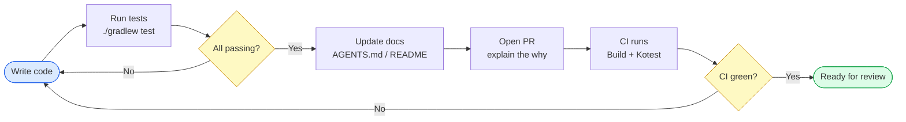
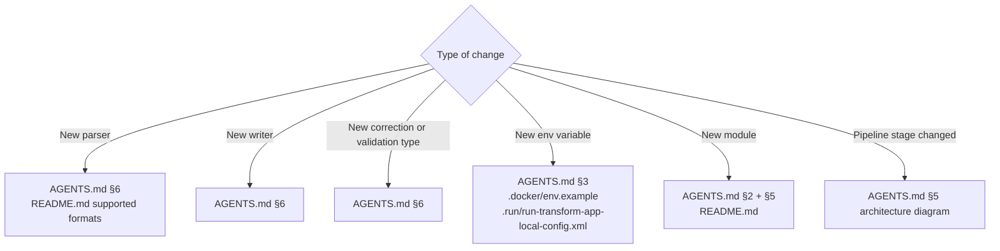

# Pull Request Checklist

## PR Lifecycle

## Code Quality

- [ ] `./gradlew build` passes (all modules, all tests)
- [ ] New code has tests — parsers use `DescribeSpec`, validators use `BehaviorSpec`
- [ ] Sensitive fields masked in all new log/error messages (`***` placeholder)
- [ ] No `runBlocking` added in production code paths outside `TransformService`
- [ ] No new `@Bean` factories unless justified — use `@Component`

## Documentation to Update

- [ ] `AGENTS.md` updated if architecture or extension points changed
- [ ] `README.md` updated if supported formats or quick-start changed
- [ ] `.docker/env.example` updated if new env variables were added
- [ ] `.run/run-transform-app-local-config.xml` updated if new env variables were added

## PR Description

- [ ] Explains the **why**, not just the **what**
- [ ] Links related issues if applicable
- [ ] Notes any breaking changes

## Common Mistakes to Avoid

| Do not                                                      | Reason                                       |
|-------------------------------------------------------------|----------------------------------------------|
| Add `flyway-database-postgresql`                            | Does not exist in Boot 3.2.3 BOM             |
| Enable `bootJar` on pipeline/scheduler modules              | No main class — build fails                  |
| Use `SpringBootApplicationConfigurationType` in `.run/` XML | Wrong type ID — IntelliJ silently ignores it |
| Commit a filled `.env` file                                 | Gitignored for a reason                      |
