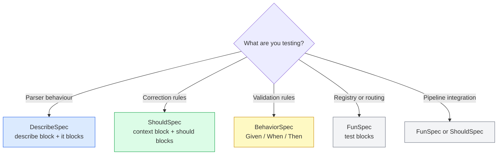
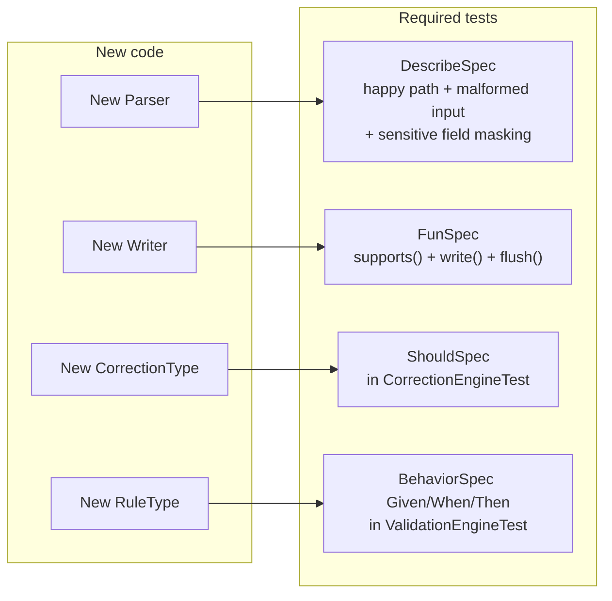
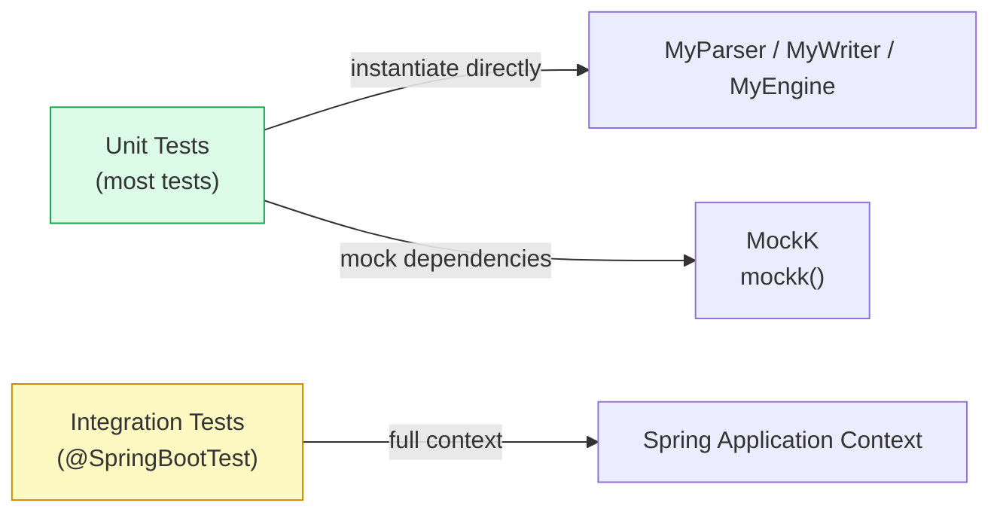

# Testing Requirements

## Framework: Kotest Only

The project uses **Kotest** exclusively. JUnit Vintage is excluded from the test classpath. Never create JUnit test classes.

## Which Spec Style to Use



## Coverage Requirements



## Coroutine Testing

```kotlin
// Use runTest for suspend functions
class MyTest : FunSpec({
    test("my suspend test") {
        runTest {
            val result = suspendFun()
            result shouldBe expected
        }
    }
})

// Use .toList() to collect flows
test("parser emits correct records") {
    val records = parser.parse(input, spec).toList()
    records shouldHaveSize 10
}
```

## Test Isolation — No Spring Context



Never use `@SpringBootTest` in unit tests — instantiate classes directly and mock dependencies with MockK.

## Running Tests

```bash
# All modules
./gradlew test

# Core only (fast — 53 tests)
./gradlew :platform-core:test

# With HTML report
./gradlew :platform-core:test && open platform-core/build/reports/tests/test/index.html
```

:::warning
All tests must pass before opening a PR. Run `./gradlew :platform-core:test` before every commit.
:::
