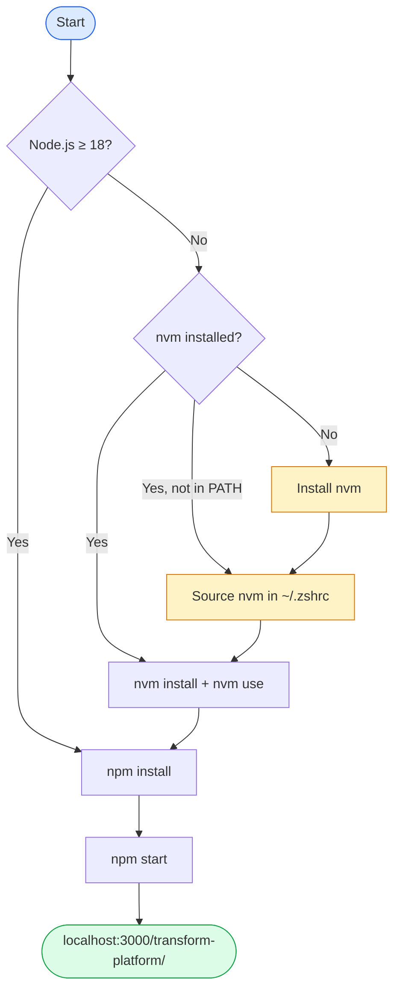
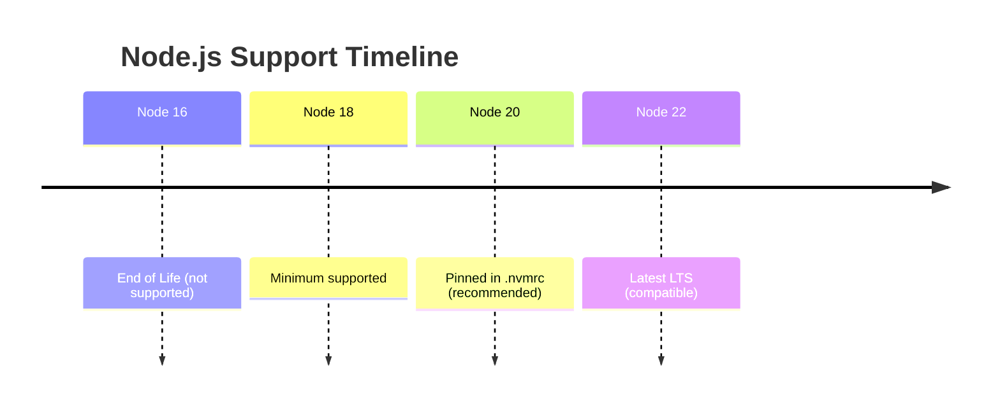
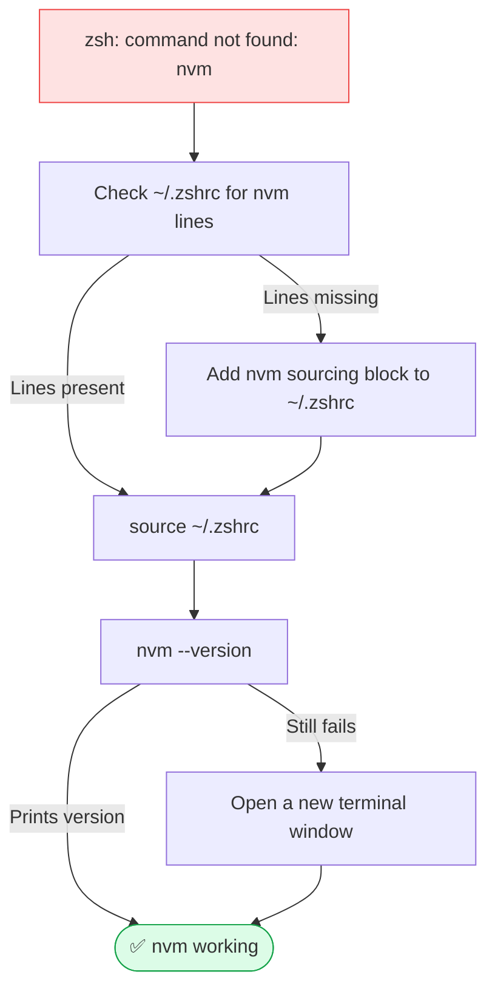
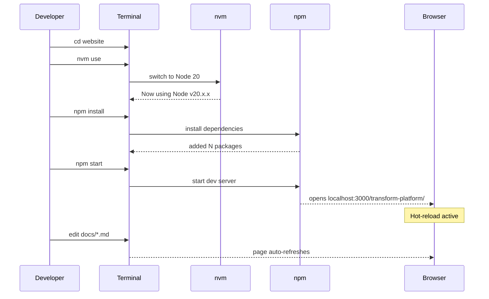
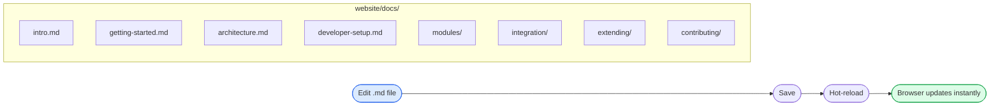
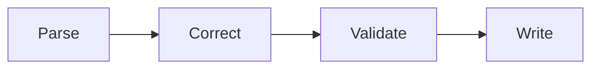
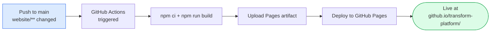

# Developer Setup

This guide covers everything you need to run the documentation site locally and contribute to the Transform Platform project.

---

## Overview



---

## Node.js Version Requirements

Docusaurus 3 requires **Node.js ≥ 18**. This project pins to **Node 20 LTS** via `.nvmrc`.



Check your current version:

```bash
node --version
```

If you see `v16.x` or lower, follow the nvm setup below.

---

## Installing nvm

[nvm (Node Version Manager)](https://github.com/nvm-sh/nvm) lets you install and switch between Node versions without touching your system Node.

```bash
curl -o- https://raw.githubusercontent.com/nvm-sh/nvm/v0.39.7/install.sh | bash
```

---

## Fixing "zsh: command not found: nvm"

After installing nvm, your shell needs to be told where to find it. This is the most common setup issue.



Add these lines to your `~/.zshrc` (for zsh) or `~/.bashrc` (for bash):

```bash
export NVM_DIR="$HOME/.nvm"
[ -s "$NVM_DIR/nvm.sh" ] && \. "$NVM_DIR/nvm.sh"
[ -s "$NVM_DIR/bash_completion" ] && \. "$NVM_DIR/bash_completion"
```

Then reload:

```bash
source ~/.zshrc
```

Verify nvm is available:

```bash
nvm --version
```

---

## Installing and Using Node 20

The `website/.nvmrc` file pins the project to Node 20. From inside `website/`:

```bash
nvm install    # reads .nvmrc → installs Node 20 if not already present
nvm use        # switches to Node 20 for this terminal session
node --version # → v20.x.x
```

To make Node 20 your default across all sessions:

```bash
nvm alias default 20
```

---

## Running the Docs Site Locally



### Step-by-step

```bash
# 1. Navigate to the website directory
cd website

# 2. Switch to the correct Node version
nvm use

# 3. Install dependencies (first time only, or after package.json changes)
npm install

# 4. Start the dev server
npm start
```

The site opens at **http://localhost:3000/transform-platform/**. Any `.md` file you edit under `docs/` refreshes instantly — no restart required.

---

## Editing Documentation



All docs live in `website/docs/`. The sidebar structure is controlled by `website/sidebars.ts`. To add a new page:

1. Create a `.md` file under `website/docs/` with a front-matter `id` field
2. Add the `id` to the appropriate category in `sidebars.ts`
3. The dev server picks it up immediately — no restart needed

---

## Adding Mermaid Diagrams

Mermaid is enabled globally. Use a fenced code block with the `mermaid` language tag:

````md

````

Supported diagram types used in this project:

| Type | Use case |
|------|----------|
| `flowchart` | Flows, pipelines, decision trees |
| `sequenceDiagram` | Service interactions, request/response |
| `classDiagram` | Data models, class hierarchies |
| `erDiagram` | Database schema |
| `gantt` | Implementation phases, timelines |
| `timeline` | Version history, roadmaps |
| `pie` | Distribution charts |
| `mindmap` | Feature overviews |

Diagrams automatically adapt to light/dark mode.

---

## Production Build

To verify the site builds without errors (same as CI):

```bash
npm run build
```

Preview the production build locally:

```bash
npm run serve
# → http://localhost:3000/transform-platform/
```

---

## Deployment

Deployment is fully automated. There is nothing to manually deploy.



- Any push to `main` that touches `website/**` automatically triggers the **Deploy Docs** workflow
- Build artifacts are never committed to the repo — the workflow hands the built output directly to GitHub Pages
- You can also trigger it manually from the **Actions** tab → **Deploy Docs** → **Run workflow**

---

## Troubleshooting

| Problem | Cause | Fix |
|---------|-------|-----|
| `Minimum Node.js version not met` | Node < 18 installed | Run `nvm install && nvm use` inside `website/` |
| `zsh: command not found: nvm` | nvm not sourced in shell | Add nvm block to `~/.zshrc`, then `source ~/.zshrc` |
| Port 3000 already in use | Another dev server running | Kill the other process or use `npm start -- --port 3001` |
| Stale styles after editing CSS | Browser cache | Hard-refresh with `Cmd+Shift+R` (Mac) / `Ctrl+Shift+R` |
| `Cannot find module` on `npm start` | Missing dependencies | Run `npm install` first |
| Mermaid diagram not rendering | Syntax error in diagram | Check the [Mermaid live editor](https://mermaid.live) |
