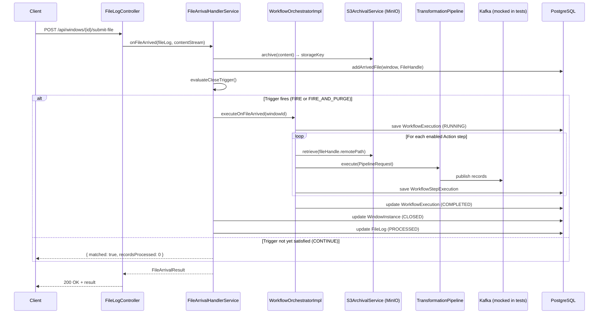

# Workflow Execution

When a [Window](./window) reaches a state transition — file arrives, window closes, or an error occurs — the platform evaluates which [Actions](./action) apply to that condition and executes them in order. Each execution run is recorded as a **WorkflowExecution**, giving full auditability and observability over what ran, when, how many records were processed, and whether it succeeded.

---

## How Execution Works

### Execution Trigger Points

Every window state transition triggers action evaluation:

| Window Event | Condition Evaluated | Typical Actions |
|---|---|---|
| File submitted to OPEN window | `ON_FILE_ARRIVED` | Parse file, publish to Kafka |
| Window transitions to `CLOSING` | `ON_CLOSING` | Flush remaining records, close reports |
| Any action in the chain fails | `ON_ERROR` | Dead-letter routing, ops alerts |

### Execution Flow



---

## WorkflowExecution Entity

Each action execution is recorded as a `WorkflowExecution` row in the `window_action_executions` table:

| Field | Type | Description |
|---|---|---|
| `id` | UUID | Unique execution ID |
| `windowInstanceId` | UUID | The window this execution belongs to |
| `profileId` | UUID | Profile that defined the action |
| `profileVersion` | Int | Snapshot of profile version at time of execution |
| `actionId` | UUID | ID of the Action that was executed |
| `actionName` | String | Human-readable action name |
| `status` | WorkflowStatus | `RUNNING`, `COMPLETED`, `COMPLETED_WITH_ERRORS`, `FAILED` |
| `totalRecordsProcessed` | Int | Sum of records across all steps |
| `errorMessage` | String? | Error details if execution failed |
| `startedAt` | Instant | When the execution began |
| `completedAt` | Instant? | When the execution finished |
| `durationMs` | Long? | Elapsed wall-clock time |

Each execution also has one or more **WorkflowStepExecution** rows (in `workflow_step_executions`) recording the outcome of each step within the action.

---

## Step Types

### PARSE_FILE

Reads the file from MinIO storage using the `FileHandle.remotePath` stored on the window, then runs the full `TransformationPipeline` (parse → validate → Kafka publish).

**Step config fields:**

| Key | Required | Description |
|---|---|---|
| `fileSpecId` | ✅ | UUID of the `FileSpec` defining how to parse the file |
| `topic` | ❌ | Kafka topic to publish to (default: `bank.statement.entries`) |
| `failOnParseError` | ❌ | If `true`, step fails when any record fails parsing (default: `false`) |

### VALIDATE

Reports the validation outcome from the preceding `PARSE_FILE` step. Validation was already performed inline by the pipeline — this step reads the counts from the execution context.

**Step config fields:**

| Key | Required | Description |
|---|---|---|
| `rejectOnError` | ❌ | If `true`, step fails when any validation error occurred (default: `false`) |

### NOTIFY

Reports the Kafka publish result from the preceding `PARSE_FILE` step. For `channel=KAFKA`, no extra work is done — the publish already happened. `WEBHOOK` channel is reserved for Phase 2.

**Step config fields:**

| Key | Required | Description |
|---|---|---|
| `channel` | ❌ | Delivery channel: `KAFKA` (default) or `WEBHOOK` (not yet implemented) |

---

## Workflow Status Values

| Status | Meaning |
|---|---|
| `RUNNING` | Execution is currently in progress |
| `COMPLETED` | All steps succeeded |
| `COMPLETED_WITH_ERRORS` | All steps ran but at least one step marked as FAILED (and `continueOnFailure=true`) |
| `FAILED` | A step failed and `continueOnFailure=false` — execution was aborted |

---

## REST API

### Submit a File to a Window

Uploads a file to an OPEN window, stores it in MinIO, evaluates the close trigger, and (if the trigger fires) runs the `ON_FILE_ARRIVED` workflow.

```http
POST /api/windows/{windowId}/submit-file
Content-Type: multipart/form-data
```

| Field | Type | Required | Description |
|---|---|---|---|
| `file` | File part | ✅ | The file to submit |
| `integrationId` | String | ❌ | Integration ID to associate with the file handle |

**Response `200 OK`:**
```json
{
  "fileLogId": "787b4dea-...",
  "windowId": "7d572524-...",
  "fileName": "camt053_sample_file.xml",
  "matched": true,
  "recordsProcessed": 14,
  "message": "Window closed successfully after processing 14 record(s)"
}
```

**Error responses:**
- `404` — window not found
- `400` — window is not `OPEN`, or the same file was already submitted to this window

### Open a PENDING Window Manually

Transitions a `PENDING` window to `OPEN` without waiting for a scheduled trigger.

```http
POST /api/windows/{id}/open
```

**Response `200 OK`:**
```json
{
  "windowId": "7d572524-...",
  "status": "OPEN",
  "openedAt": "2026-03-23T14:26:57.950801Z",
  "profileId": "b005ed80-..."
}
```

**Error responses:**
- `404` — window or profile not found
- `400` — window is not `PENDING`, or overlap policy blocked opening

### List Workflow Executions for a Window

```http
GET /api/windows/{windowId}/executions
```

**Response `200 OK`:** Array of `WorkflowExecutionSummaryResponse` objects.

### Get Execution Detail

```http
GET /api/executions/{id}
```

**Response `200 OK`:** Full `WorkflowExecutionDetailResponse` including all step executions.

### List All Executions

```http
GET /api/executions?status=COMPLETED&limit=50
```

| Param | Description |
|---|---|
| `status` | Filter by status (`RUNNING`, `COMPLETED`, `FAILED`, etc.) |
| `limit` | Max results to return (default: `100`) |

---

## End-to-End Example: CAMT053 Bank Statement

The following sequence creates a complete working pipeline:

**1. Create a FileSpec for CAMT053:**

```bash
curl -X POST http://localhost:8080/api/v1/specs \
  -H 'Content-Type: application/json' \
  -d '{
    "name": "CAMT053 Entries",
    "format": "ISO20022",
    "metadata": { "recordXPath": "//*[local-name()='\''Ntry'\'']" },
    "fields": [
      { "name": "entryRef",  "type": "STRING", "path": "*[local-name()='\''NtryRef'\'']" },
      { "name": "amount",    "type": "STRING", "path": "*[local-name()='\''Amt'\'']" },
      { "name": "indicator", "type": "STRING", "path": "*[local-name()='\''CdtDbtInd'\'']" }
    ]
  }'
```

**2. Create a Profile with `FILE_ARRIVAL` triggers and a `PARSE_FILE` action:**

```bash
curl -X POST http://localhost:8080/api/profiles \
  -H 'Content-Type: application/json' \
  -d '{
    "name": "Daily CAMT053 Processing",
    "windowConfig": {
      "openTrigger":  { "type": "FILE_ARRIVAL", "integrationId": "manual", "filePattern": "*.xml" },
      "closeTrigger": { "type": "FILE_ARRIVAL", "integrationId": "manual", "filePattern": "*.xml" }
    },
    "actions": [{
      "name": "Parse and Publish",
      "condition": "ON_FILE_ARRIVED",
      "steps": [{
        "name": "Parse CAMT053",
        "stepType": "PARSE_FILE",
        "config": { "fileSpecId": "<spec-id>", "topic": "bank.statement.entries" }
      }]
    }]
  }'
```

**3. Enable the profile, open the window, submit the file:**

```bash
curl -X POST http://localhost:8080/api/profiles/<profile-id>/enable
curl -X POST http://localhost:8080/api/windows/<window-id>/open
curl -X POST http://localhost:8080/api/windows/<window-id>/submit-file \
  -F "file=@camt053_sample_file.xml"
```

The window will transition `PENDING → OPEN → CLOSING → CLOSED`, and the `WorkflowExecution` will be `COMPLETED` with the number of parsed records.
