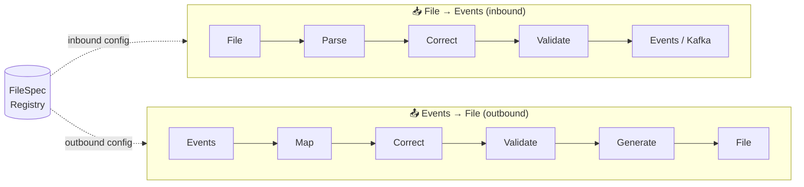

# Events → File: Spec-Driven File Generation

The platform is fully bidirectional. The same `FileSpec` that drives inbound parsing also drives outbound file generation — the spec registry is the single source of truth for both directions.

---

## The Symmetric Design

The inbound and outbound pipelines are mirrors of each other. Both are driven by `FileSpec`, both reuse `CorrectionEngine` and `ValidationEngine`, and both follow the Open/Closed extension model.



The only new stages are **Map** (event fields → file fields) and **Generate** (validated records → file bytes). Everything else — correction rules, validation rules, error severity routing — is identical code, re-entered from the other side.

---

## FileSpec Extended with OutboundConfig

`FileSpec` gains an optional `outbound: OutboundConfig` section. When present, the spec registry knows this spec supports file generation. When absent, the spec is inbound-only.

```kotlin
data class FileSpec(
    val id: UUID,
    val name: String,
    val format: FileFormat,

    // ── Inbound (existing) ──────────────────────────────────────────────────
    val fields: List<FieldSpec>,
    val correctionRules: List<CorrectionRule> = emptyList(),
    val validationRules: List<ValidationRule> = emptyList(),

    // ── Outbound (new) ──────────────────────────────────────────────────────
    val outbound: OutboundConfig? = null,
)

data class OutboundConfig(
    /** Target file format — can differ from inbound (e.g., receive JSON, produce NACHA) */
    val format: FileFormat,

    /** How to map incoming event/record fields to output file fields */
    val fieldMappings: List<FieldMapping>,

    /** Explicit field ordering for the output file */
    val fieldOrder: List<String>,

    /** Outbound-specific correction rules (run after mapping) */
    val correctionRules: List<CorrectionRule> = emptyList(),

    /** Outbound-specific validation rules (run after correction) */
    val validationRules: List<ValidationRule> = emptyList(),

    /** Optional file header template (e.g., NACHA file header record) */
    val headerTemplate: String? = null,

    /** Optional file footer/control record template */
    val footerTemplate: String? = null,

    /** Optional field to group records by before writing (e.g., "batchDate") */
    val aggregationKey: String? = null,

    val encoding: String = "UTF-8",
    val fileNamingPattern: String = "output_{specId}_{timestamp}.{ext}",
)

data class FieldMapping(
    /** Source field name — coming from the incoming event or ParsedRecord */
    val sourceField: String,

    /** Target field name in the output file */
    val targetField: String,

    /** Optional transform: UPPERCASE, TRIM, PAD_LEFT, FORMAT_DATE, etc. */
    val transform: String? = null,

    /** Value to use when sourceField is null or missing */
    val defaultValue: String? = null,
)
```

---

## Pipeline Stages

### 1. EventMapper — fields in, FileRecord out

`EventMapper` reads the `OutboundConfig.fieldMappings` from the spec and projects each incoming event or `ParsedRecord` into a `FileRecord`. It applies simple per-field transforms (`UPPERCASE`, `PAD_LEFT`, `FORMAT_DATE`, etc.) at this stage.

```kotlin
interface EventMapper {
    fun map(event: ParsedRecord, config: OutboundConfig): FileRecord
}

data class FileRecord(
    val fields: Map<String, String?>,   // ordered, ready to write
    val metadata: RecordMetadata,
)
```

The spec controls everything — which source fields to include, what to rename them to, and any lightweight per-field formatting. Business logic stays in correction rules.

### 2. CorrectionEngine — same engine, outbound rules

The existing `CorrectionEngine` runs again, this time against `OutboundConfig.correctionRules`. This is the same class, zero changes. Outbound rules might handle things like:

- Right-padding fixed-width fields to match NACHA record length
- Converting date formats from ISO-8601 to `YYMMDD`
- Applying routing number check-digit corrections

### 3. ValidationEngine — same engine, outbound rules

`ValidationEngine` runs against `OutboundConfig.validationRules`. The same severity model applies — `WARNING` flows through, `ERROR` is configurable, `FATAL` skips the record. Outbound rules might check:

- Required fields present before writing (e.g., routing number not blank)
- Amount fields within permitted range
- Record count matches batch header expectations

### 4. GeneratorRegistry — symmetric to ParserRegistry

`GeneratorRegistry` auto-discovers all `@Component` beans implementing `FileGenerator`, just like `ParserRegistry` does for `FileParser`.

```kotlin
interface FileGenerator {
    val generatorName: String

    /** Returns true when this generator can produce the given format */
    fun supports(format: FileFormat): Boolean

    /**
     * Consumes a Flow of validated FileRecords and writes them to an OutputStream.
     * Called with the full OutboundConfig so the generator knows field order,
     * header/footer templates, encoding, etc.
     */
    suspend fun generate(
        records: Flow<FileRecord>,
        config: OutboundConfig,
        output: OutputStream,
    )
}
```

Example — a fixed-width NACHA generator:

```kotlin
@Component
class NachaFileGenerator : FileGenerator {

    override val generatorName = "NACHA_GENERATOR"

    override fun supports(format: FileFormat) = format == FileFormat.NACHA

    override suspend fun generate(
        records: Flow<FileRecord>,
        config: OutboundConfig,
        output: OutputStream,
    ) {
        val writer = output.bufferedWriter(charset(config.encoding))

        config.headerTemplate?.let { writer.writeLine(it) }

        var entryCount = 0
        records.collect { record ->
            writer.writeLine(buildNachaEntry(record, config))
            entryCount++
        }

        config.footerTemplate?.let {
            writer.writeLine(renderFooter(it, entryCount))
        }

        writer.flush()
    }
}
```

Adding a new output format = implement `FileGenerator`, annotate `@Component`, done.

---

## EventToFilePipeline

The new top-level orchestrator mirrors `TransformationPipeline`:

```kotlin
@Service
class EventToFilePipeline(
    private val eventMapper: EventMapper,
    private val correctionEngine: CorrectionEngine,
    private val validationEngine: ValidationEngine,
    private val generatorRegistry: GeneratorRegistry,
) {
    suspend fun process(
        events: Flow<ParsedRecord>,
        spec: FileSpec,
        request: OutboundPipelineRequest,
    ): OutboundProcessingResult {
        val config = spec.outbound
            ?: error("Spec '${spec.name}' has no outbound config")

        val generator = generatorRegistry.resolve(config.format)

        var processed = 0; var failed = 0

        val fileRecords: Flow<FileRecord> = events
            .map    { event  -> eventMapper.map(event, config) }
            .map    { record -> correctionEngine.applyCorrections(record, config.correctionRules) }
            .map    { record -> validationEngine.validate(record, config.validationRules) }
            .filter { record ->
                if (record.hasFatalErrors()) { failed++; false }
                else { processed++; true }
            }

        val outputStream = ByteArrayOutputStream()
        generator.generate(fileRecords, config, outputStream)

        return OutboundProcessingResult(
            processedRecords = processed,
            failedRecords    = failed,
            outputBytes      = outputStream.toByteArray(),
            fileName         = renderFileName(config.fileNamingPattern, spec),
        )
    }
}
```

---

## Spec Registry Query

The spec registry gains two new query methods so callers can discover which specs support each direction:

```kotlin
interface SpecRegistry {
    fun findById(id: UUID): FileSpec?
    fun findAll(): List<FileSpec>

    // New
    fun findInboundSpecs(): List<FileSpec>   = findAll().filter { it.fields.isNotEmpty() }
    fun findOutboundSpecs(): List<FileSpec>  = findAll().filter { it.outbound != null }
    fun findBidirectionalSpecs(): List<FileSpec> =
        findAll().filter { it.fields.isNotEmpty() && it.outbound != null }
}
```

A spec can be inbound-only, outbound-only, or fully bidirectional — all controlled by what's configured in the spec, with zero code changes.

---

## OutboundConfig Example — JSON over API

When creating or updating a spec via the API, the `outbound` block is optional:

```json
{
  "name": "Bank ABC Transaction File",
  "format": "CSV",
  "fields": [
    { "name": "amount",      "type": "DECIMAL", "required": true  },
    { "name": "accountNo",   "type": "STRING",  "required": true  },
    { "name": "description", "type": "STRING",  "required": false }
  ],
  "correctionRules": [...],
  "validationRules": [...],
  "outbound": {
    "format": "NACHA",
    "fieldOrder": ["routingNo", "accountNo", "amount", "transactionCode"],
    "fieldMappings": [
      { "sourceField": "accountNo",   "targetField": "accountNo"     },
      { "sourceField": "amount",      "targetField": "amount",  "transform": "FORMAT_DECIMAL_2DP" },
      { "sourceField": "routing",     "targetField": "routingNo"     },
      { "sourceField": "txType",      "targetField": "transactionCode", "defaultValue": "22" }
    ],
    "correctionRules": [
      { "field": "amount", "type": "PAD_LEFT", "length": 10, "padChar": "0" }
    ],
    "validationRules": [
      { "field": "routingNo", "type": "REQUIRED" },
      { "field": "amount",    "type": "POSITIVE_NUMBER" }
    ],
    "headerTemplate": "101 {routingNo} {companyId} {fileDate} {fileTime} A094101{companyName}",
    "footerTemplate": "9{batchCount:6}{blockCount:6}{entryCount:8}{totalDebit:12}{totalCredit:12}",
    "fileNamingPattern": "NACHA_{date}_{specId}.txt",
    "encoding": "UTF-8"
  }
}
```

---

## Integration with the Delivery Pipeline

`OutboundProcessingResult` carries the raw `outputBytes` and a suggested `fileName`. The Integration Domain delivers it:

```mermaid
flowchart LR
    ETFP["EventToFilePipeline\nreturns OutboundProcessingResult"] --> REG["IntegrationRegistry\nresolve outbound connector"]
    REG -->|SFTP_OUTBOUND| S[SftpConnector.sendFile]
    REG -->|S3_OUTBOUND|   S3[S3Connector.sendFile]
    REG -->|REST_WEBHOOK|  R[RestConnector.sendFile]
```

The `OutboundPipelineRequest` carries the `clientId` and `deliveryIntegrationId` — the integration registry resolves the live connector, same as the inbound SFTP poller does today.

---

## Adding a New Output Format

Same pattern as adding a parser — implement one interface, one annotation:

```kotlin
@Component
class SwiftMt940Generator : FileGenerator {

    override val generatorName = "SWIFT_MT940_GENERATOR"

    override fun supports(format: FileFormat) = format == FileFormat.SWIFT_MT940

    override suspend fun generate(
        records: Flow<FileRecord>,
        config: OutboundConfig,
        output: OutputStream,
    ) {
        // write SWIFT MT940 statement lines
    }
}
```

Zero changes to `GeneratorRegistry`, `EventToFilePipeline`, or any existing generator.

---

## Key Classes Summary

| Class | Package | Role |
|-------|---------|------|
| `OutboundConfig` | `core.spec.model` | Outbound section of `FileSpec` — drives generation |
| `FieldMapping` | `core.spec.model` | Maps one event field to one output field with optional transform |
| `FileRecord` | `core.spec.model` | Intermediate model flowing through the outbound pipeline |
| `EventMapper` | `core.transformers` | Projects `ParsedRecord` → `FileRecord` using `FieldMapping` list |
| `FileGenerator` | `core.generators` | Interface for all file format writers (NACHA, CSV, SWIFT…) |
| `GeneratorRegistry` | `core.generators` | Auto-discovers `@Component FileGenerator` beans |
| `EventToFilePipeline` | `core.pipeline` | Orchestrates the full outbound flow |
| `OutboundProcessingResult` | `core.pipeline` | Result: processed count, failed count, output bytes, filename |
