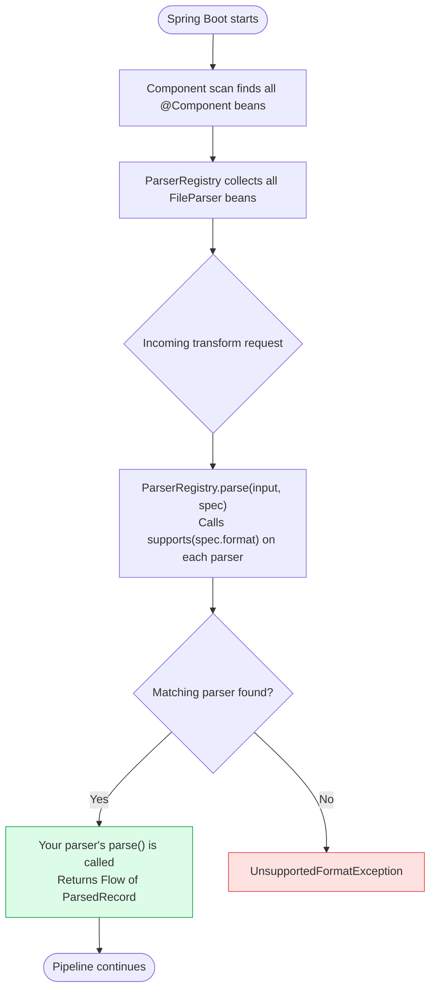

# Adding a New Parser

Transform Platform uses the Open/Closed principle — adding a new file format requires implementing one interface and annotating with `@Component`. No changes to `ParserRegistry` or `TransformationPipeline`.

## How Parser Discovery Works



## Steps

### 1. Create the parser file

```
platform-core/src/main/kotlin/com/transformplatform/core/parsers/impl/NachaFileParser.kt
```

### 2. Implement `FileParser`

```kotlin
@Component
class NachaFileParser : FileParser {

    override val parserName = "NACHA_PARSER"

    override fun supports(format: FileFormat) = format == FileFormat.NACHA

    override fun parse(input: InputStream, spec: FileSpec): Flow<ParsedRecord> = flow {
        // Stream records line by line — never load the full file into memory
        // For each record, emit a ParsedRecord
        // On field errors: add ParseError to the record, do NOT throw
        emit(
            ParsedRecord(
                fields = mapOf("routingNumber" to "021000021", "amount" to "10050"),
                errors = emptyList(),
                rowNumber = 1L
            )
        )
    }

    override fun validateSpec(spec: FileSpec) {
        // Optional: throw SpecValidationException if the spec is incompatible with NACHA
    }
}
```

### 3. Add the format enum value (if new)

If `FileFormat.NACHA` doesn't exist yet, add it to `FileSpec.kt`:

```kotlin
enum class FileFormat {
    CSV, FIXED_WIDTH, XML, JSON, NACHA, ISO_20022
}
```

### 4. Write tests

Create `platform-core/src/test/kotlin/com/transformplatform/core/parsers/NachaFileParserTest.kt`:

```kotlin
class NachaFileParserTest : DescribeSpec({

    val parser = NachaFileParser()

    describe("supports()") {
        it("returns true for NACHA format") {
            parser.supports(FileFormat.NACHA) shouldBe true
        }
        it("returns false for other formats") {
            parser.supports(FileFormat.CSV) shouldBe false
        }
    }

    describe("parse()") {
        it("emits one record per NACHA entry detail") {
            val input = /* test file input stream */
            val spec = /* minimal FileSpec for NACHA */
            val records = parser.parse(input, spec).toList()
            records shouldHaveSize 3
        }
    }
})
```

Run: `./gradlew :platform-core:test`

## Checklist

- [ ] Parser implements `FileParser` and is annotated `@Component`
- [ ] `supports()` is accurate — exactly one parser should match each format
- [ ] `parse()` returns a `Flow<ParsedRecord>` — never a `List`
- [ ] Errors are added to `ParsedRecord.errors` — never thrown inside the flow
- [ ] Sensitive fields masked with `"***"` in any error messages
- [ ] `DescribeSpec` tests cover happy path and error cases
- [ ] `AGENTS.md` §6 and `README.md` supported formats updated

:::warning
Never throw inside a `Flow { }` block. Exceptions inside a flow create uncollectable flows. Always catch, create a `ParseError`, and add it to the record.
:::
