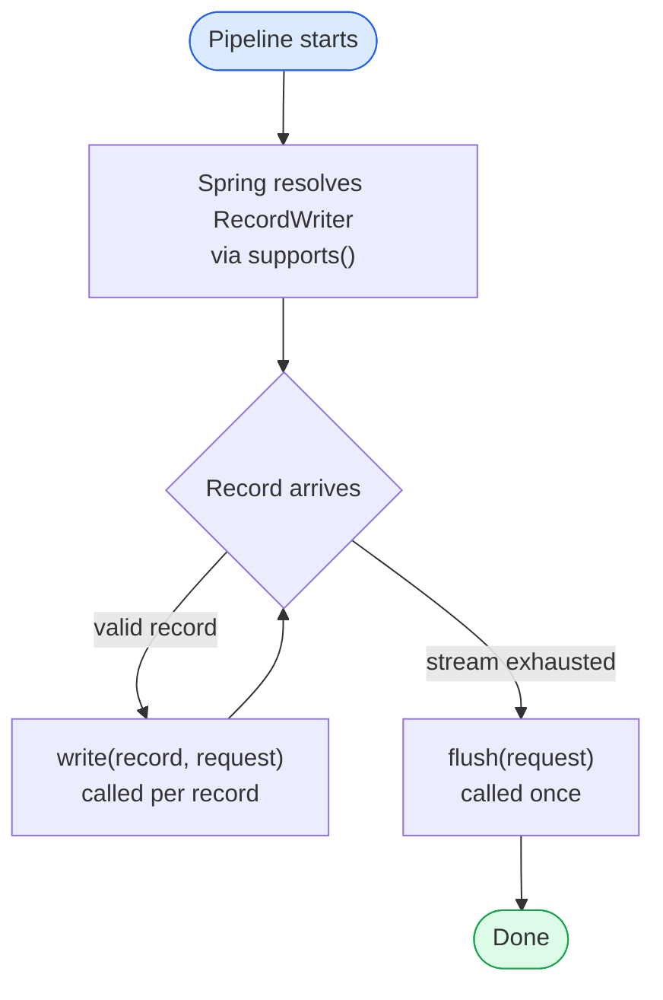
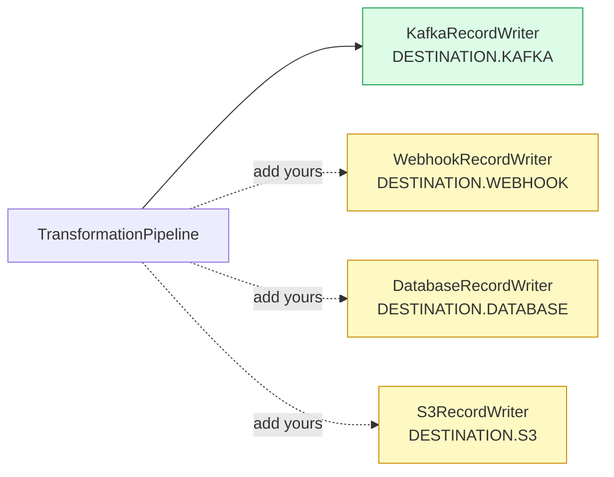

# Adding a New Writer

Writers consume the validated `ParsedRecord` stream and route records to a destination — Kafka, webhook, database, S3, etc.

## Writer Lifecycle



## Available Destinations



## Steps

### 1. Create the writer file

```
platform-core/src/main/kotlin/com/transformplatform/core/writers/WebhookRecordWriter.kt
```

### 2. Implement `RecordWriter`

```kotlin
@Component
class WebhookRecordWriter(private val webClient: WebClient) : RecordWriter {

    override val writerName = "WEBHOOK_WRITER"

    override fun supports(type: DestinationType) = type == DestinationType.WEBHOOK

    override suspend fun write(record: ParsedRecord, request: PipelineRequest) {
        val payload = record.fields  // serialize as needed
        webClient.post()
            .uri(request.destination.url!!)
            .bodyValue(payload)
            .retrieve()
            .awaitBodilessEntity()
    }

    override suspend fun flush(request: PipelineRequest) {
        // Called once after all records — use for batching, connection cleanup, etc.
    }
}
```

### 3. Add the destination type enum value (if new)

```kotlin
enum class DestinationType {
    KAFKA, FILE, DATABASE, WEBHOOK
}
```

### 4. Write tests

```kotlin
class WebhookRecordWriterTest : FunSpec({

    val mockWebClient = mockk<WebClient>()
    val writer = WebhookRecordWriter(mockWebClient)

    test("supports WEBHOOK destination") {
        writer.supports(DestinationType.WEBHOOK) shouldBe true
    }

    test("does not support KAFKA destination") {
        writer.supports(DestinationType.KAFKA) shouldBe false
    }
})
```

## Checklist

- [ ] Writer implements `RecordWriter` and is annotated `@Component`
- [ ] `supports()` matches exactly one `DestinationType`
- [ ] `write()` is `suspend` — uses coroutines for I/O
- [ ] `flush()` implemented if batching or connection cleanup is needed
- [ ] Tests cover `supports()`, `write()`, and `flush()`
- [ ] `AGENTS.md` §6 updated with the new writer
