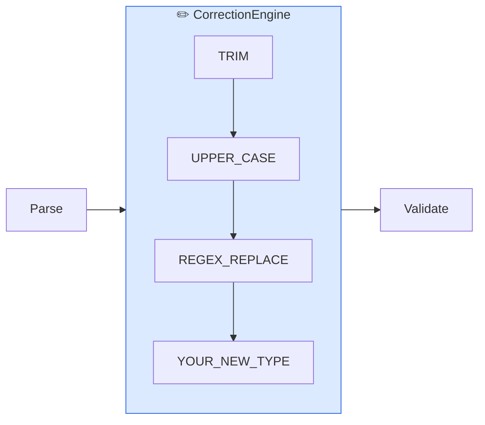
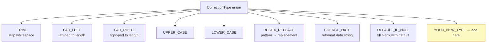
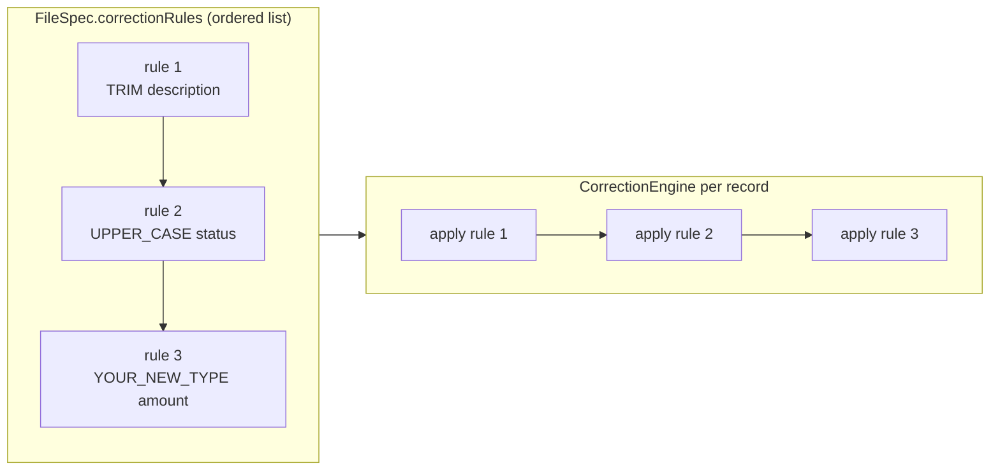

# Adding a New Correction Rule Type

Correction rules run **before** validation. They clean, normalize, and transform field values before business rules are applied.

## Where Corrections Fit



## Built-in Correction Types



## Steps

### 1. Add the enum value

In `FileSpec.kt`, add to `CorrectionType`:

```kotlin
enum class CorrectionType {
    TRIM, PAD_LEFT, PAD_RIGHT, UPPER_CASE, LOWER_CASE, REGEX_REPLACE,
    COERCE_DATE, DEFAULT_IF_NULL,
    YOUR_NEW_TYPE   // ← add here
}
```

### 2. Add the `when` branch in `CorrectionEngine`

```kotlin
fun applyCorrection(value: Any?, rule: CorrectionRule, fieldSpec: FieldSpec): Any? {
    return when (rule.correctionType) {
        CorrectionType.TRIM -> (value as? String)?.trim()
        // ... existing cases ...
        CorrectionType.YOUR_NEW_TYPE -> {
            // implement transformation
            value
        }
    }
}
```

### 3. Write tests using `ShouldSpec`

```kotlin
class CorrectionEngineTest : ShouldSpec({

    val engine = CorrectionEngine()

    context("YOUR_NEW_TYPE correction") {
        should("transform value correctly") {
            val rule = CorrectionRule(
                ruleId = "test",
                field = "amount",
                correctionType = CorrectionType.YOUR_NEW_TYPE
            )
            engine.applyCorrection("input", rule, fieldSpec) shouldBe "expected output"
        }
    }
})
```

```bash
./gradlew :platform-core:test
```

## Correction Rule Execution Order



Rules are applied in `applyOrder` — the order they appear in the `correctionRules` list in the spec.

## Checklist

- [ ] New enum value added to `CorrectionType`
- [ ] `when` branch added in `CorrectionEngine.applyCorrection()`
- [ ] `ShouldSpec` tests added to `CorrectionEngineTest`
- [ ] `AGENTS.md` §6 updated
