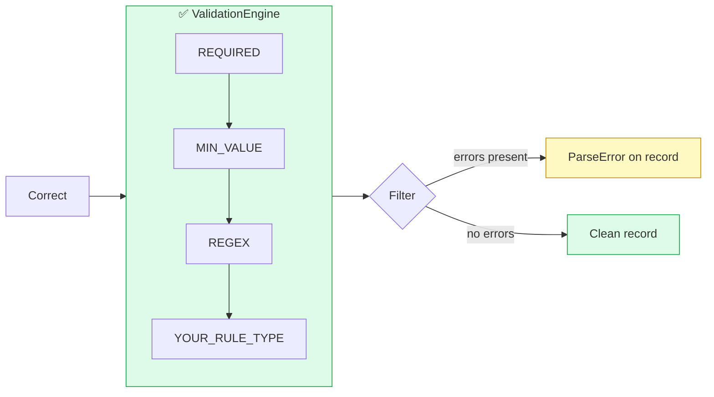
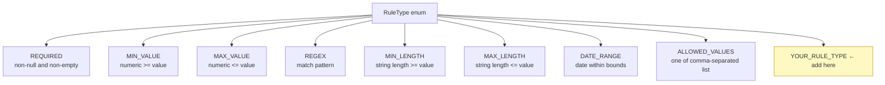
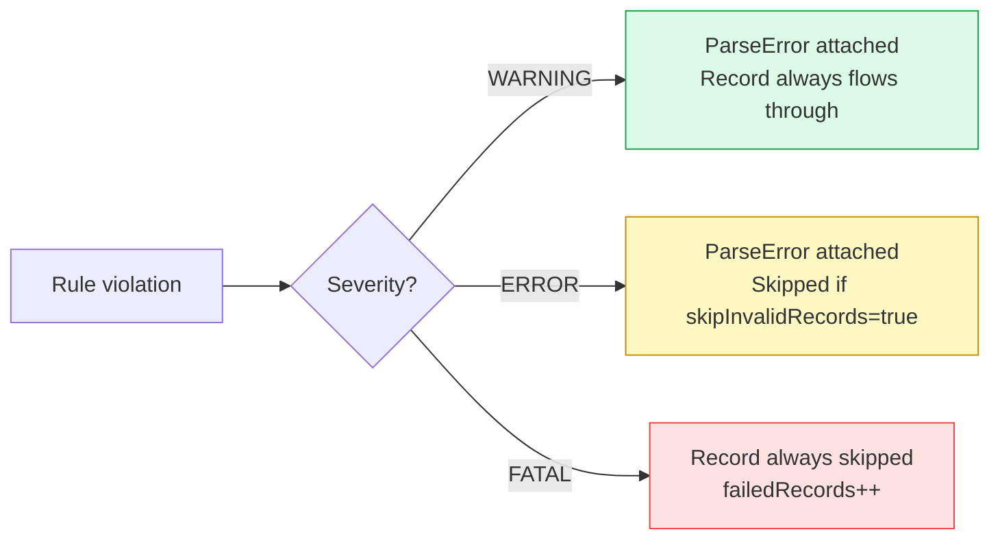

# Adding a New Validation Rule Type

Validation rules run **after** correction. They attach `ParseError` objects to records — they never throw, and the pipeline never stops on a bad record.

## Where Validation Fits



## Built-in Rule Types



## Severity Levels



## Steps

### 1. Add the enum value

In `FileSpec.kt`, add to `RuleType`:

```kotlin
enum class RuleType {
    REQUIRED, MIN_VALUE, MAX_VALUE, REGEX, MIN_LENGTH, MAX_LENGTH,
    DATE_RANGE, ALLOWED_VALUES,
    YOUR_RULE_TYPE   // ← add here
}
```

### 2. Add the `when` branch in `ValidationEngine`

```kotlin
fun checkRule(value: Any?, rule: ValidationRule, fieldSpec: FieldSpec): ParseError? {
    return when (rule.ruleType) {
        RuleType.REQUIRED -> if (value == null || value == "") ParseError(rule.ruleId, rule.message, rule.severity) else null
        // ... existing cases ...
        RuleType.YOUR_RULE_TYPE -> {
            // return ParseError if invalid, null if valid
            null
        }
    }
}
```

### 3. Write tests using `BehaviorSpec`

```kotlin
class ValidationEngineTest : BehaviorSpec({

    val engine = ValidationEngine()

    Given("a YOUR_RULE_TYPE validation rule") {
        val rule = ValidationRule(
            ruleId = "test-rule",
            field = "amount",
            ruleType = RuleType.YOUR_RULE_TYPE,
            value = "100",
            message = "Value must meet the condition",
            severity = Severity.ERROR
        )

        When("the value meets the condition") {
            val error = engine.checkRule("50", rule, fieldSpec)
            Then("no error is returned") {
                error shouldBe null
            }
        }

        When("the value does not meet the condition") {
            val error = engine.checkRule("200", rule, fieldSpec)
            Then("an error is returned") {
                error shouldNotBe null
                error!!.severity shouldBe Severity.ERROR
            }
        }
    }
})
```

```bash
./gradlew :platform-core:test
```

## Checklist

- [ ] New enum value added to `RuleType`
- [ ] `when` branch added in `ValidationEngine.checkRule()`
- [ ] `BehaviorSpec` (Given/When/Then) tests added to `ValidationEngineTest`
- [ ] `AGENTS.md` §6 updated
