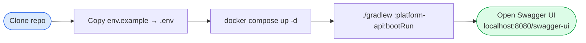

# Getting Started

Get the Transform Platform running locally in about 5 minutes.

## Setup Flow



## Prerequisites

- **JDK 21+** — [Download Temurin](https://adoptium.net/)
- **Docker & Docker Compose** — [Install Docker](https://docs.docker.com/get-docker/)
- **Gradle 8+** — bundled via `./gradlew` (no separate install needed)

## 1. Clone the Repository

```bash
git clone https://github.com/avinashreddyoceans/transform-platform.git
cd transform-platform
```

## 2. Configure Environment

Copy the example env file and fill in any required values:

```bash
cp .docker/env.example .env
```

:::tip
For a local dev setup the defaults in `env.example` work out of the box. You only need to change values for production deployments.
:::

## 3. Start Infrastructure

Bring up Postgres, Kafka, Zookeeper, and Kafka UI with Docker Compose:

```bash
docker compose -f .docker/docker-compose.yml up -d
```

| Service | Default Port |
|---------|-------------|
| PostgreSQL | 5432 |
| Kafka | 9092 |
| Kafka UI | 8090 |

## 4. Run the API

```bash
./gradlew :platform-api:bootRun
```

The Spring Boot application starts on **port 8080**.

## 5. Verify

Open the Swagger UI to confirm the API is running:

```
http://localhost:8080/swagger-ui
```

## 6. Run Tests

```bash
./gradlew test
```

All 53 tests in `platform-core` should pass.

---

## Quick Transform Walkthrough

### Step 1 — Register a Spec

```http
POST /api/v1/specs
Content-Type: application/json

{
  "name": "Bank Transactions CSV",
  "format": "CSV",
  "hasHeader": true,
  "delimiter": ",",
  "fields": [
    { "name": "accountNumber", "type": "STRING",  "columnName": "account_number", "sensitive": true },
    { "name": "amount",        "type": "DECIMAL", "columnName": "amount" },
    { "name": "transactionDate","type": "DATE",   "columnName": "date", "format": "yyyy-MM-dd" },
    { "name": "description",   "type": "STRING",  "columnName": "description", "required": false }
  ],
  "correctionRules": [
    { "ruleId": "trim-desc", "field": "description", "correctionType": "TRIM" }
  ],
  "validationRules": [
    { "ruleId": "amount-positive", "field": "amount", "ruleType": "MIN_VALUE", "value": "0",
      "message": "Amount must be positive", "severity": "ERROR" }
  ]
}
```

The response contains a `specId` — hold onto it.

### Step 2 — Transform a File

```bash
curl -X POST http://localhost:8080/api/v1/transform/file-to-events \
  -F "file=@transactions.csv" \
  -F "specId=<your-spec-id>" \
  -F "kafkaTopic=bank-transactions"
```

Records are parsed, corrected, validated, and published to Kafka. The response includes a `ProcessingResult` with counts for processed, failed, and skipped records.

---

## IntelliJ IDEA Setup

Shared run configurations are committed to `.run/` and `.idea/runConfigurations/`. Open the project in IntelliJ and the **Run Transform App (Local)** and **Docker Compose Dependencies** configurations should appear automatically.
