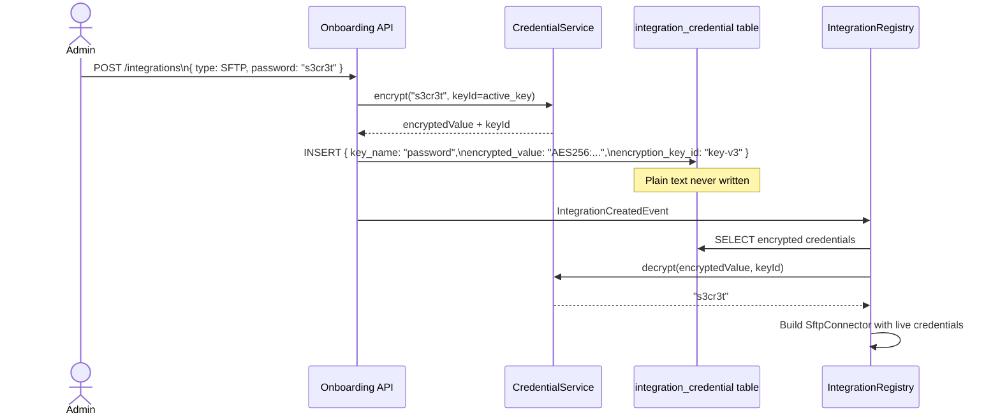
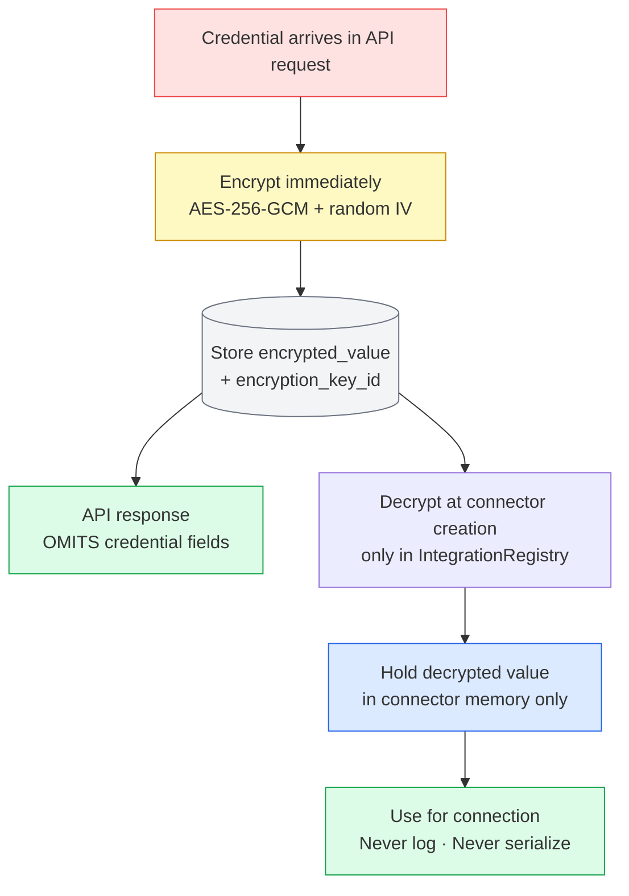
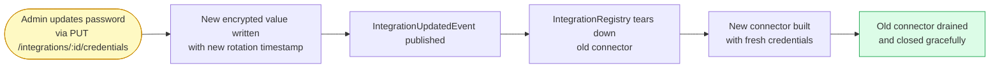

# Credential Management

Credentials (passwords, private keys, tokens, secrets) are **never stored in plain text**. Every credential value is encrypted before it touches the database and decrypted only at connector creation time, in memory.

## Encryption Flow

## Credential Rules

## Credential Types by Integration

| Integration | Credential keys | Notes |
|-------------|----------------|-------|
| SFTP password | `password` | Encrypted string |
| SFTP private key | `privateKey`, `passphrase` | PEM encoded, passphrase optional |
| Kafka SASL | `saslUsername`, `saslPassword` | Used for SCRAM or PLAIN |
| REST Basic Auth | `basicPassword` | Base64 in Authorization header |
| REST Bearer / OAuth2 | `bearerToken` or `clientSecret` | Token or secret for OAuth2 flow |
| S3 | `accessKeyId`, `secretAccessKey` | Or use IAM role (no credentials needed) |
| AS2 | `privateKey`, `partnerCertificate` | For signing + encryption |

## Credential Rotation

:::tip Zero-downtime rotation
The registry keeps the old connector alive until the new one is healthy. In-flight writes complete on the old connector before it closes.
:::

## What is NEVER stored

- Plain text passwords anywhere in the DB
- Credentials in application logs (even DEBUG level)
- Credentials in API responses or error messages
- Credentials in Kafka event payloads
- Credentials in git (even `.env` files)
