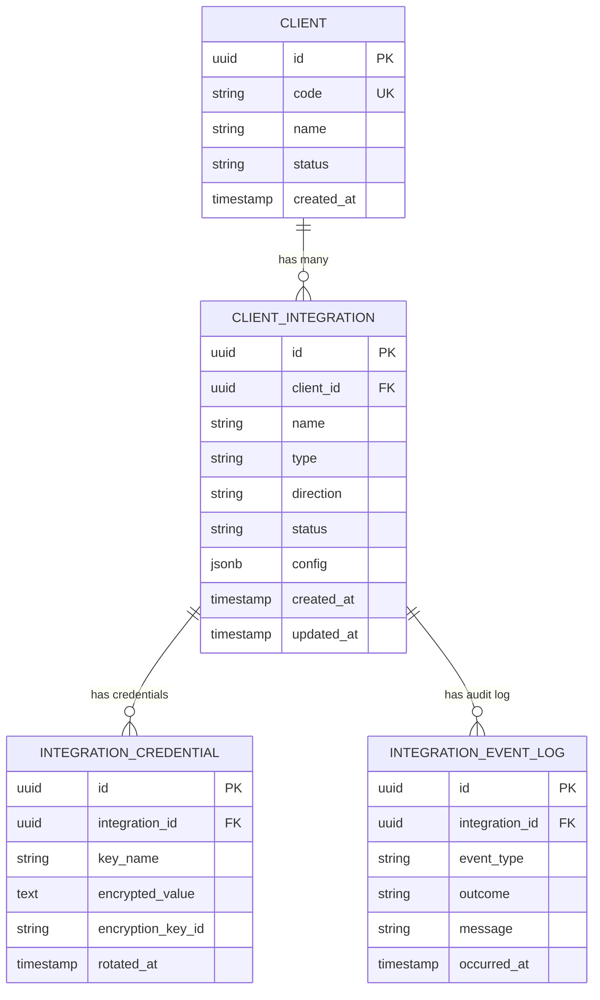
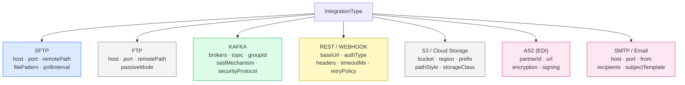
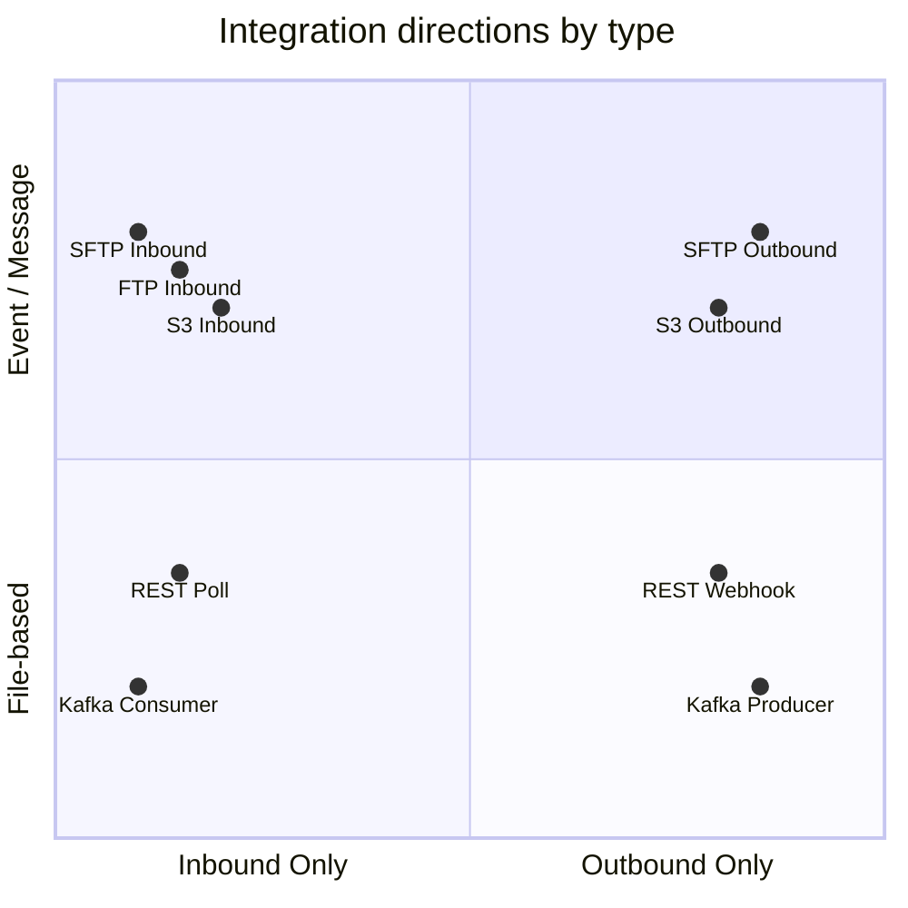
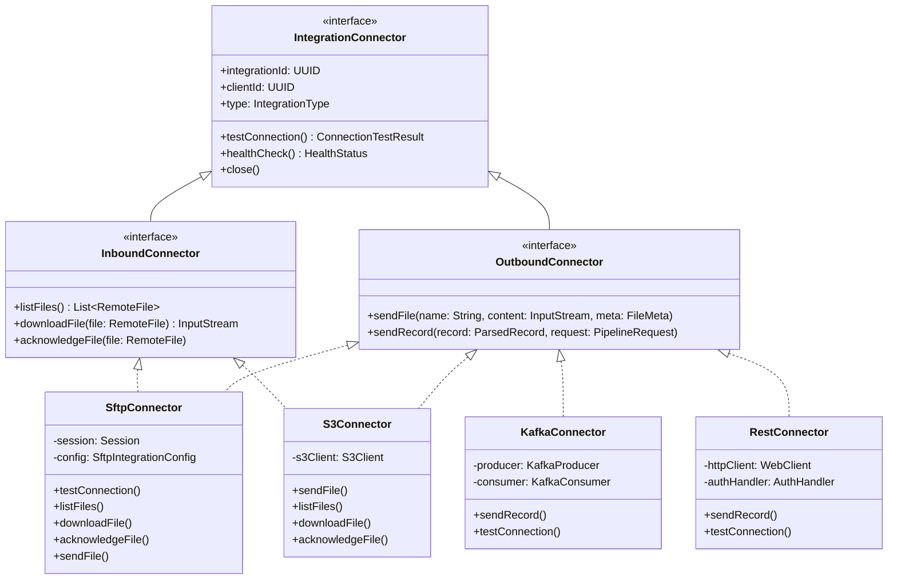
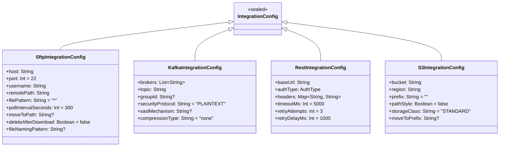

# Integration Domain Model

## Entity Relationships

## Integration Types

## Integration Direction Matrix

## Connector Interface Hierarchy

## Type-Specific Configs

Each integration type has its own config class serialized as `JSONB` in the `config` column.

