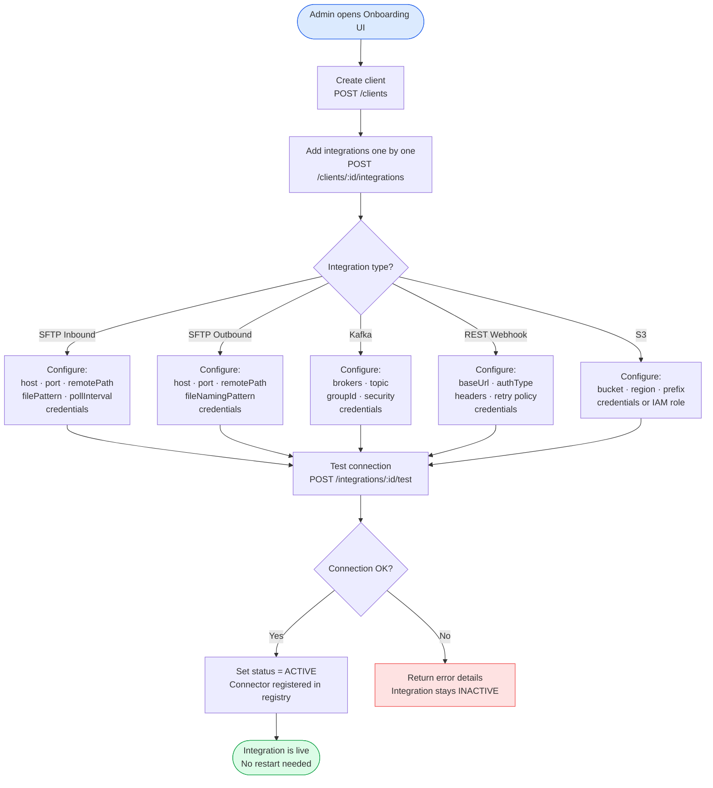
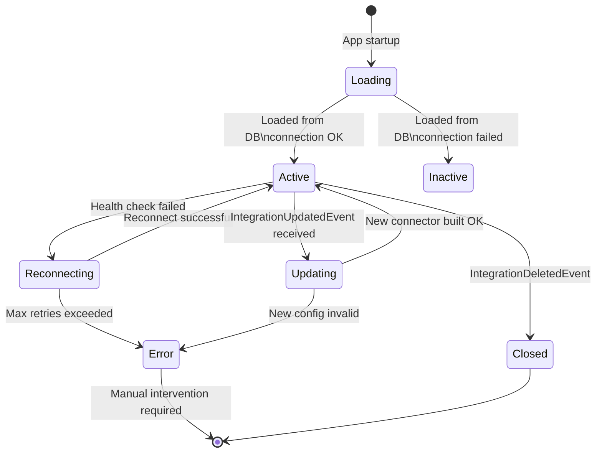
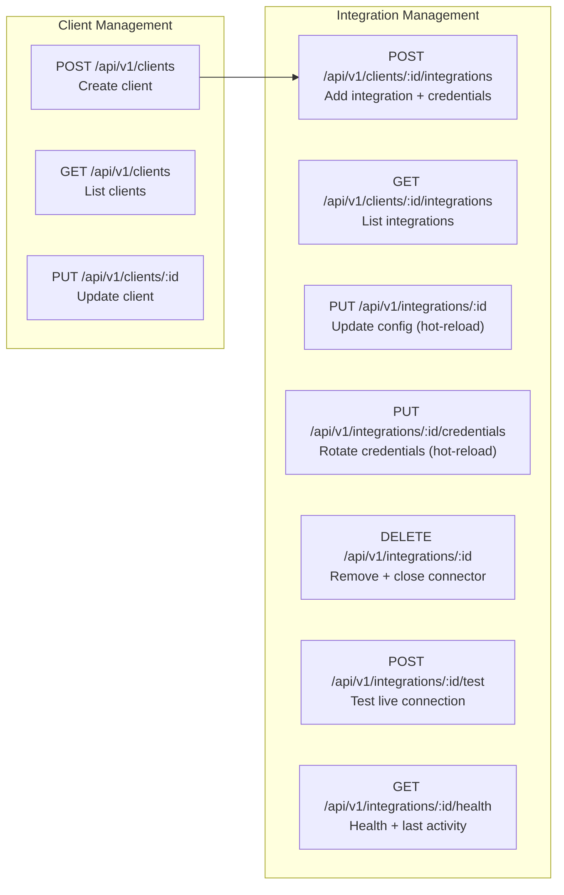
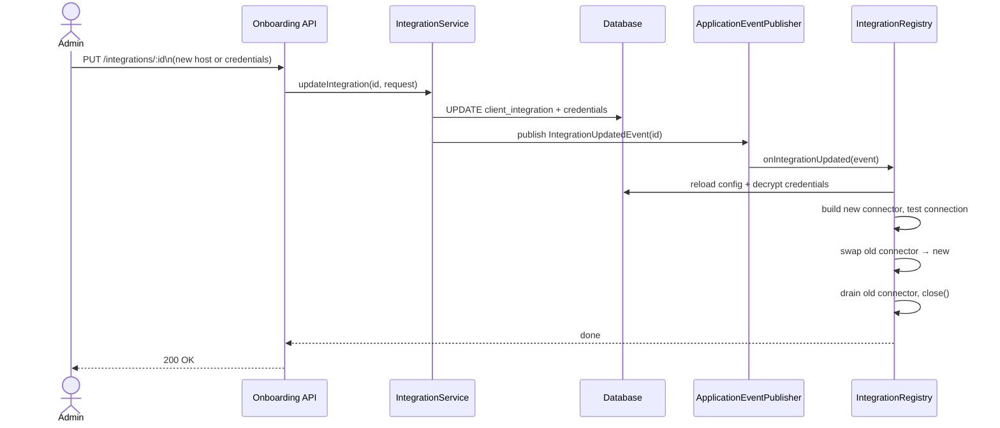
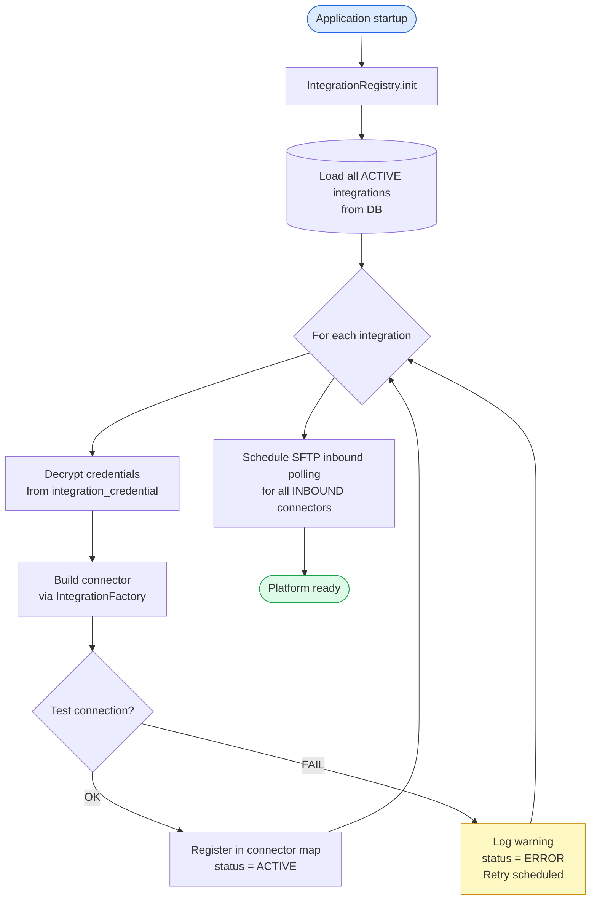

# Dynamic Onboarding

When a new client is onboarded, their integrations are configured via the API at runtime — no restarts, no code changes, no redeploys.

## Onboarding Flow — New Client

## IntegrationRegistry Lifecycle

## API Endpoints

## Hot-Reload — Update Without Restart

## Connector Startup on App Boot

