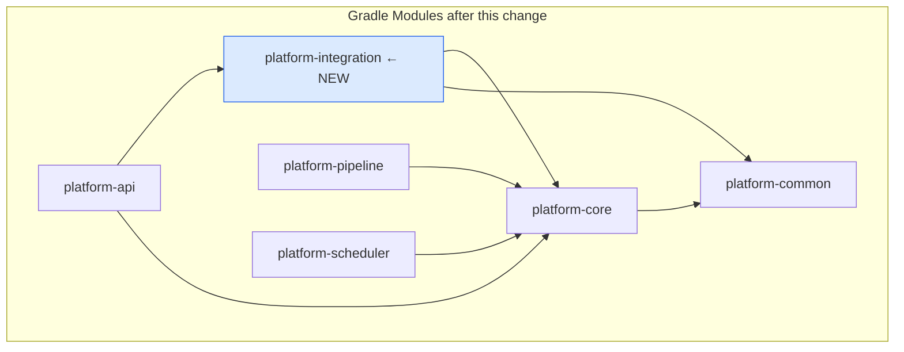
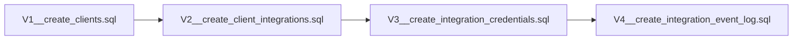
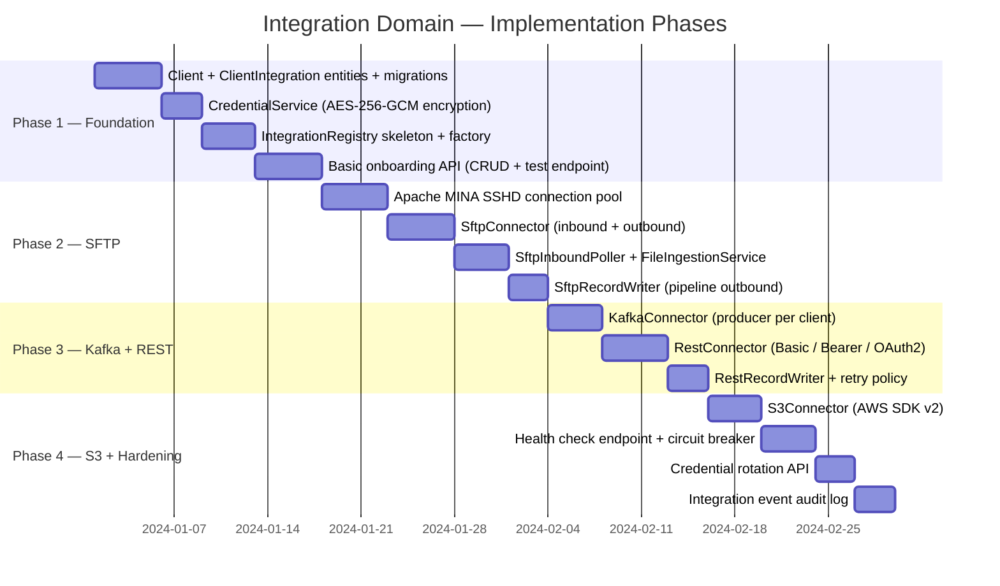

# Module Structure & Implementation Plan

## New Module: `platform-integration`



## Package Layout

```
platform-integration/
└── src/main/kotlin/com/transformplatform/integration/
    │
    ├── domain/                          # JPA entities
    │   ├── Client.kt                    # Tenant entity
    │   ├── ClientIntegration.kt         # Integration config entity
    │   ├── IntegrationCredential.kt     # Encrypted credential entity
    │   ├── IntegrationEventLog.kt       # Audit log entity
    │   ├── IntegrationType.kt           # enum: SFTP, KAFKA, REST, S3, FTP, AS2
    │   ├── IntegrationDirection.kt      # enum: INBOUND, OUTBOUND, BIDIRECTIONAL
    │   └── IntegrationStatus.kt         # enum: ACTIVE, INACTIVE, ERROR, TESTING
    │
    ├── config/                          # Type-specific config data classes
    │   ├── IntegrationConfig.kt         # sealed class — base
    │   ├── SftpIntegrationConfig.kt
    │   ├── KafkaIntegrationConfig.kt
    │   ├── RestIntegrationConfig.kt
    │   └── S3IntegrationConfig.kt
    │
    ├── connector/                       # Live connection objects
    │   ├── IntegrationConnector.kt      # interface
    │   ├── InboundConnector.kt          # interface
    │   ├── OutboundConnector.kt         # interface
    │   ├── sftp/
    │   │   ├── SftpConnector.kt         # implements both In + Out
    │   │   ├── SftpConnectionPool.kt    # Apache MINA SSHD pool
    │   │   └── SftpInboundPoller.kt     # @Scheduled polling task
    │   ├── kafka/
    │   │   └── KafkaConnector.kt
    │   ├── rest/
    │   │   ├── RestConnector.kt
    │   │   └── auth/
    │   │       ├── BasicAuthHandler.kt
    │   │       ├── BearerAuthHandler.kt
    │   │       └── OAuth2AuthHandler.kt
    │   └── s3/
    │       └── S3Connector.kt
    │
    ├── registry/
    │   ├── IntegrationRegistry.kt       # manages live connectors, handles events
    │   └── IntegrationFactory.kt        # creates connectors from config + credentials
    │
    ├── credential/
    │   ├── CredentialService.kt         # encrypt / decrypt
    │   └── AesGcmEncryption.kt          # AES-256-GCM implementation
    │
    ├── writers/                         # RecordWriter implementations for pipeline
    │   ├── SftpRecordWriter.kt          # implements RecordWriter, looks up registry
    │   ├── S3RecordWriter.kt
    │   └── RestRecordWriter.kt
    │
    ├── inbound/
    │   └── FileIngestionService.kt      # orchestrates inbound polling → pipeline
    │
    ├── repository/
    │   ├── ClientRepository.kt
    │   ├── ClientIntegrationRepository.kt
    │   └── IntegrationCredentialRepository.kt
    │
    ├── service/
    │   └── IntegrationService.kt        # CRUD + lifecycle management
    │
    └── events/
        ├── IntegrationCreatedEvent.kt
        ├── IntegrationUpdatedEvent.kt
        └── IntegrationDeletedEvent.kt
```

## Database Migrations (Flyway)



## Implementation Phases



## Key Dependencies to Add

```kotlin
// platform-integration/build.gradle.kts

dependencies {
    implementation(project(":platform-core"))
    implementation(project(":platform-common"))

    // SFTP — Apache MINA SSHD
    implementation("org.apache.sshd:sshd-sftp:2.12.1")
    implementation("org.apache.sshd:sshd-common:2.12.1")

    // S3 — AWS SDK v2
    implementation("software.amazon.awssdk:s3:2.25.0")

    // Encryption
    implementation("org.bouncycastle:bcprov-jdk18on:1.77")

    // Spring Data JPA (already in Boot BOM)
    implementation("org.springframework.boot:spring-boot-starter-data-jpa")
}
```

## Design Decisions

| Decision | Choice | Reason |
|----------|--------|--------|
| SFTP library | Apache MINA SSHD | Actively maintained, connection pooling, modern key exchange |
| Credential encryption | AES-256-GCM | Authenticated encryption, random IV per value |
| Registry events | Spring `ApplicationEventPublisher` | No new infra needed, stays in-process |
| Config storage | `JSONB` column | Flexible, queryable, avoids one-table-per-type sprawl |
| Circuit breaker | Resilience4j | Already standard in Spring Boot ecosystem |
| Credential rotation | Zero-downtime swap | Drain old connector, activate new before closing |
