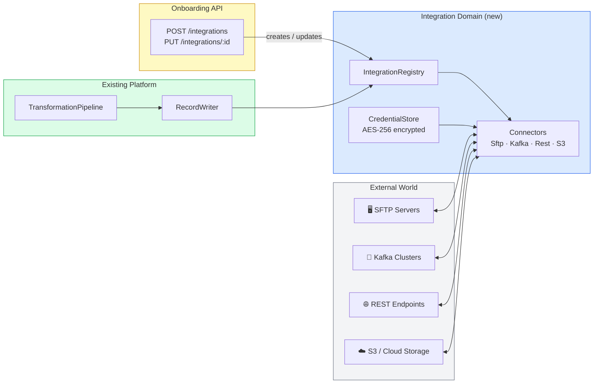

# Integration Domain

The Integration Domain is the layer that knows **how to move data** to and from the outside world. It is client-aware, dynamically configurable at runtime, and credential-safe.

## Why a Separate Domain?

The existing pipeline knows how to **transform** data. It does not know which bank's SFTP server to pull from, which Kafka cluster a client is subscribed to, or what OAuth token to use for a REST webhook. That knowledge belongs here — the Integration Domain.

## Core Concepts

| Concept | What it is |
|---------|-----------|
| **Client** | A tenant — a bank, insurer, or partner that uses the platform |
| **ClientIntegration** | One configured integration for one client (e.g., "Bank A outbound SFTP") |
| **IntegrationConnector** | The live, authenticated connection object held in memory |
| **IntegrationRegistry** | The in-memory map of all active connectors, hot-reloaded on change |
| **CredentialStore** | Encrypted storage for passwords, keys, tokens — never in plain text |
| **IntegrationDirection** | `INBOUND` (we pull/receive), `OUTBOUND` (we push/send), `BIDIRECTIONAL` |
