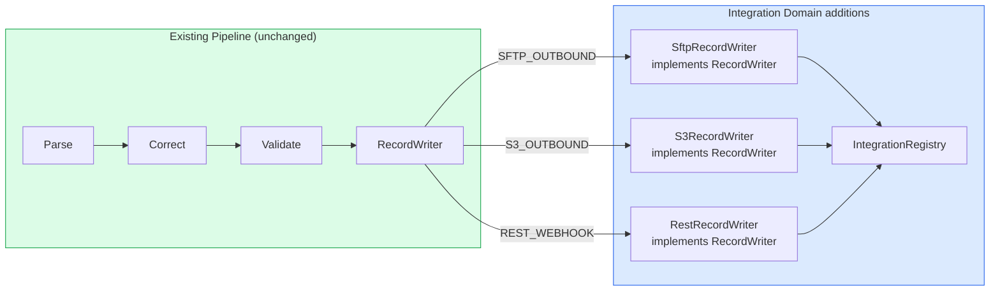
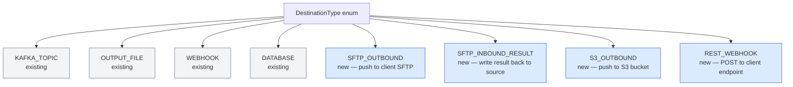
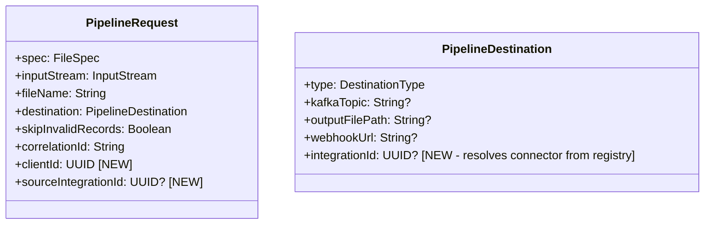
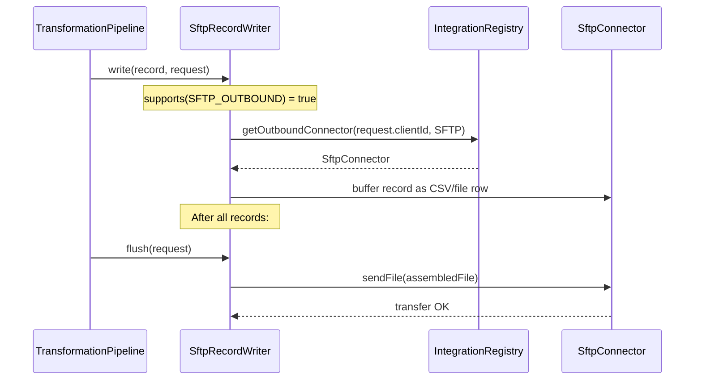
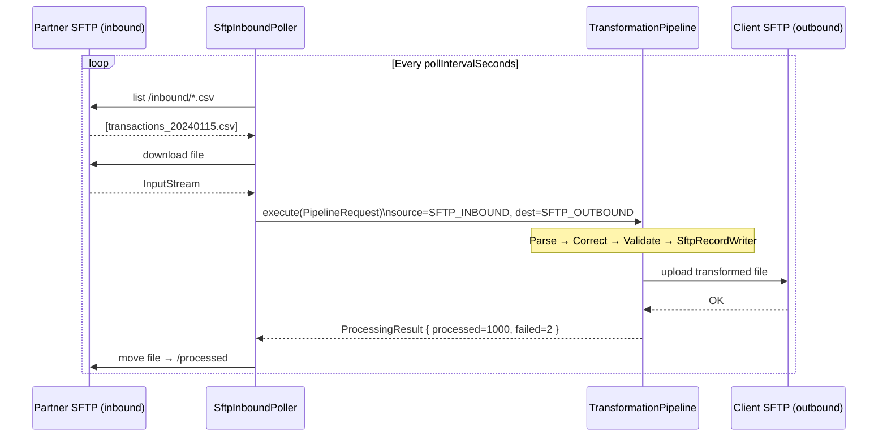

# How the Integration Domain Connects to the Pipeline

The existing `TransformationPipeline` is untouched. The Integration Domain hooks in through two extension points: the `RecordWriter` interface (outbound) and a new `FileIngestionService` (inbound).

## Current vs Extended Pipeline



## New DestinationType Values

The `DestinationType` enum gains new values to cover all integration destinations:



## PipelineRequest Changes

`PipelineRequest` gains a `clientId` and an optional `deliveryIntegrationId`:



## Outbound Writer Resolution



## Inbound File Ingestion Flow

Inbound connectors are **not** driven by the pipeline — they drive the pipeline. A scheduled poller pulls files and feeds them in.

```mermaid
flowchart TD
    POLL([SftpInboundPoller\n@Scheduled or Quartz]) --> LIST[List files on SFTP]
    LIST --> DL[Download file]
    DL --> SPEC[Lookup client's FileSpec\nfor this integration]
    SPEC --> REQ[Build PipelineRequest\nclientId + sourceIntegrationId]
    REQ --> PIPE[TransformationPipeline.execute]
    PIPE --> RESULT{Result}
    RESULT -->|OK| ACK[Acknowledge file on SFTP\nMove to /processed]
    RESULT -->|FAILED| QUARANTINE[Move to /error\nPublish IngestionFailedEvent]

    style POLL fill:#dbeafe,stroke:#2563eb
    style ACK fill:#dcfce7,stroke:#16a34a
    style QUARANTINE fill:#fee2e2,stroke:#ef4444
```

## Complete End-to-End: SFTP-in → Transform → SFTP-out


