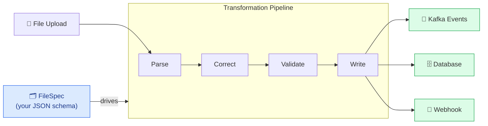
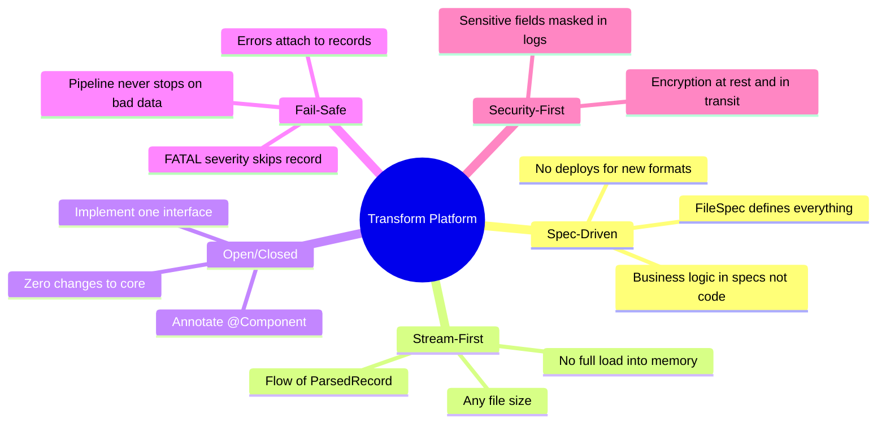
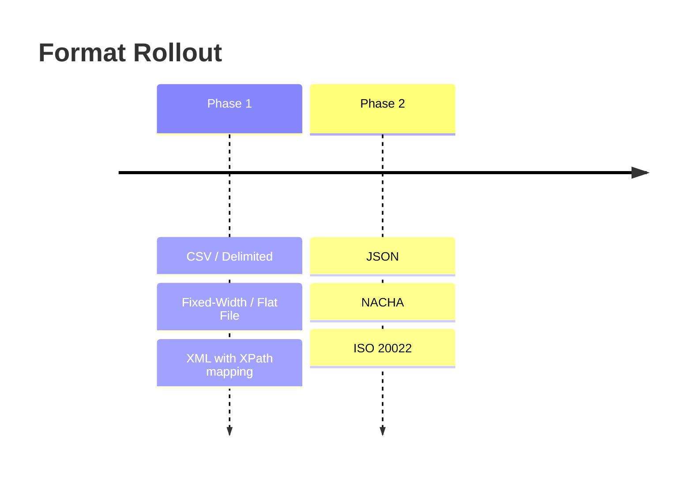

# Transform Platform

**Enterprise-grade, spec-driven file ↔ event transformation engine.**

Transform Platform lets you parse, validate, correct, and route any file format — without writing code. Define a `FileSpec`, upload a file, and the platform handles the rest.

## How It Works

## Key Principles

## Supported Formats

## Next Steps

- [Getting Started](/getting-started) — run the platform locally in minutes
- [Architecture](/architecture) — understand the transformation pipeline
- [API Reference](/api-reference) — REST endpoints for spec management and file transforms
