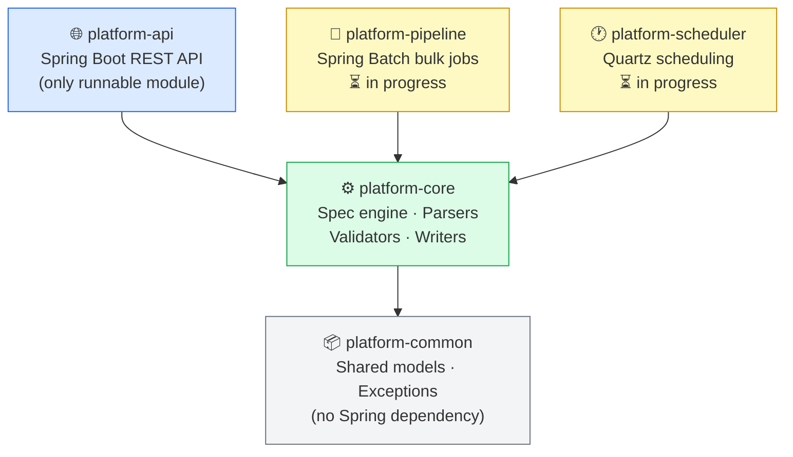

# Module Overview

The platform is split into four Gradle modules, each with a single responsibility.

## Module Dependency Graph

## Module Summary

| Module | Purpose | Runnable? |
|--------|---------|-----------|
| [`platform-common`](./platform-common) | Shared models, exceptions, utilities — no Spring | No |
| [`platform-core`](./platform-core) | Spec engine, parsers, validators, transformers, writers | No |
| [`platform-api`](./platform-api) | REST API — spec management, file upload, transform orchestration | **Yes** |
| `platform-pipeline` | Spring Batch jobs for bulk processing *(in progress)* | No |
| `platform-scheduler` | Quartz-based scheduling and delay engine *(in progress)* | No |

:::warning
Never enable `bootJar` on `platform-pipeline` or `platform-scheduler` — they have no `main` class and the build will fail.
:::
