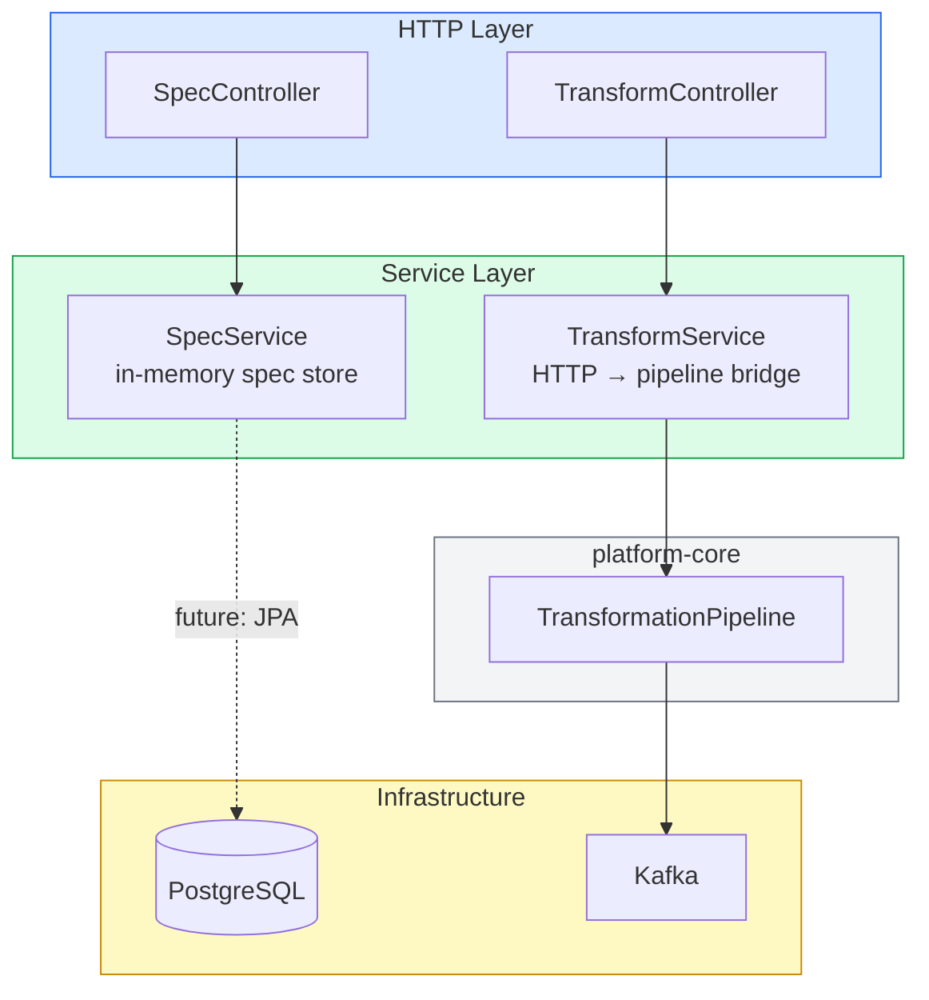
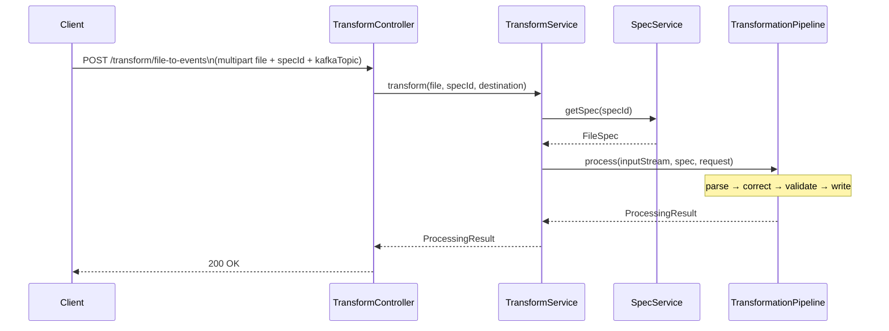

# platform-api

The runnable Spring Boot module. Exposes a REST API for spec management, file uploads, and transform orchestration.

## Layer Diagram



## Startup

```bash
./gradlew :platform-api:bootRun
```

Swagger UI: `http://localhost:8080/swagger-ui`

## Request Flow — File Transform



## Environment Variables

| Variable | Default | Description |
|----------|---------|-------------|
| `SPRING_DATASOURCE_URL` | `jdbc:postgresql://localhost:5432/transform` | Database URL |
| `SPRING_KAFKA_BOOTSTRAP_SERVERS` | `localhost:9092` | Kafka brokers |
| `JWT_SECRET` | *(required)* | HMAC secret for JWT signing |

See `.docker/env.example` for the full list.

## API Documentation

Interactive docs at `/swagger-ui` via SpringDoc OpenAPI 2.3.0. See [API Reference](/api-reference) for all endpoints.
