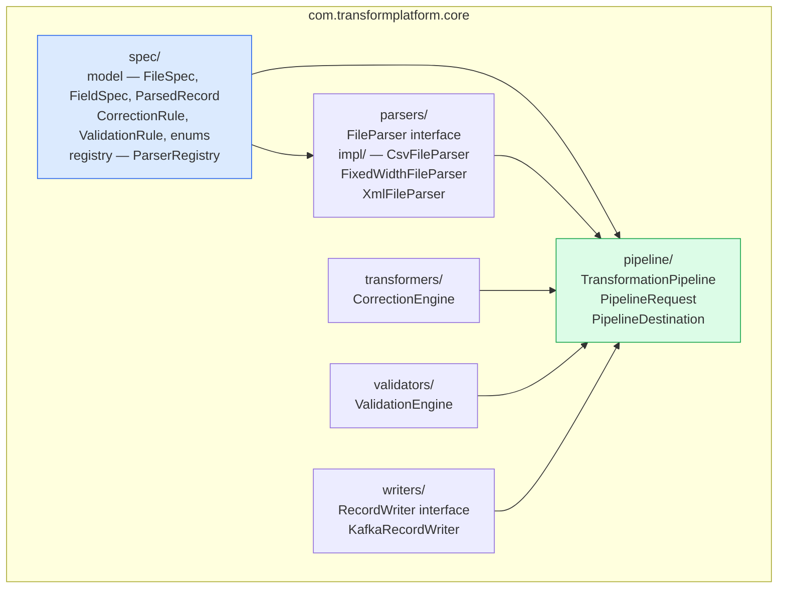
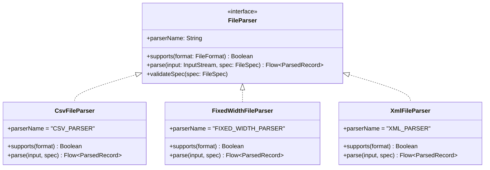
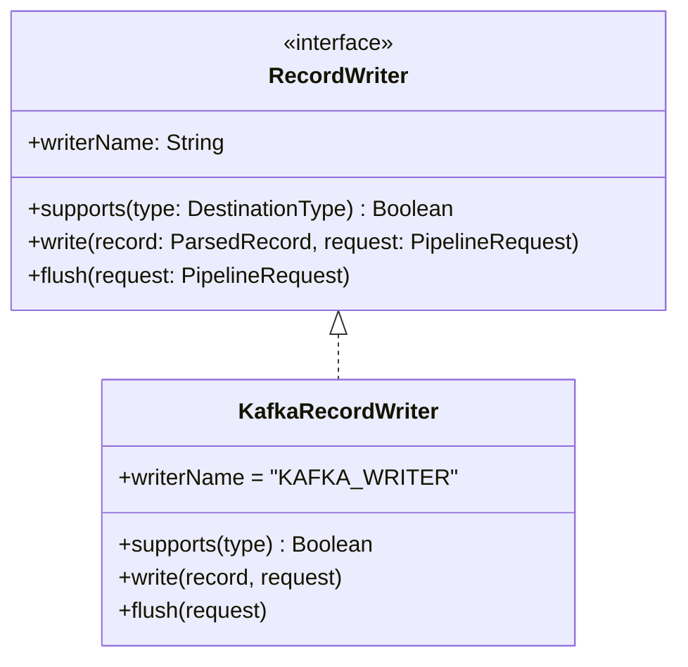
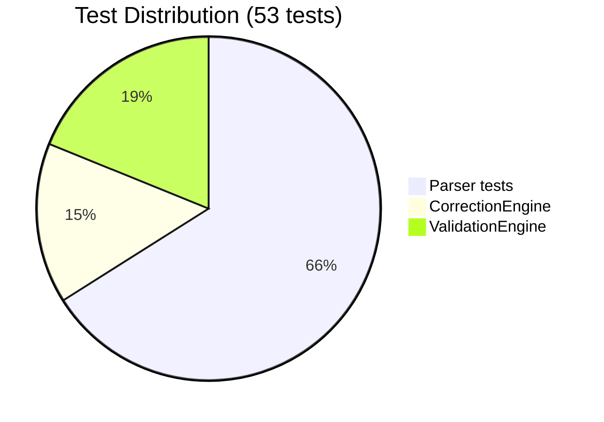

# platform-core

The heart of the platform. Contains all transformation logic — parsers, validators, transformers, and writers. 53 passing Kotest tests.

## Package Structure



## Key Interfaces

### FileParser — how parsers plug in



### RecordWriter — how writers plug in



## Test Coverage



| Test suite | Kotest style | Count |
|-----------|-------------|-------|
| `CsvFileParserTest` | `DescribeSpec` | ~15 |
| `FixedWidthFileParserTest` | `DescribeSpec` | ~10 |
| `XmlFileParserTest` | `DescribeSpec` | ~10 |
| `CorrectionEngineTest` | `ShouldSpec` | ~8 |
| `ValidationEngineTest` | `BehaviorSpec` | ~10 |
| `ParserRegistryTest` | `FunSpec` | ~5 |
| `TransformationPipelineTest` | `ShouldSpec` | ~5 |

```bash
./gradlew :platform-core:test
```
