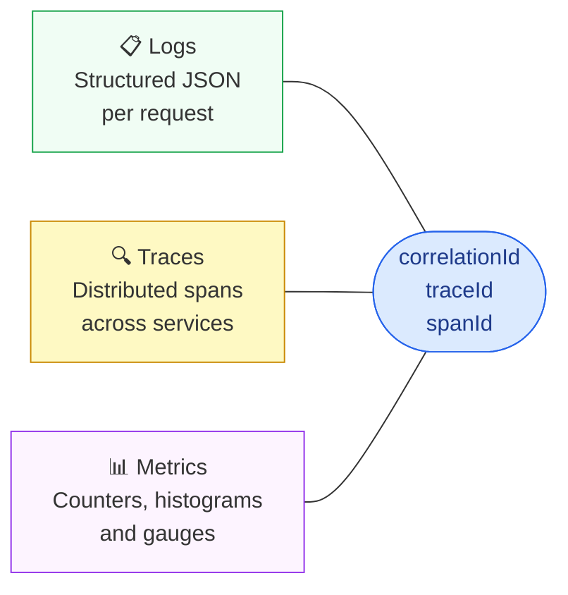
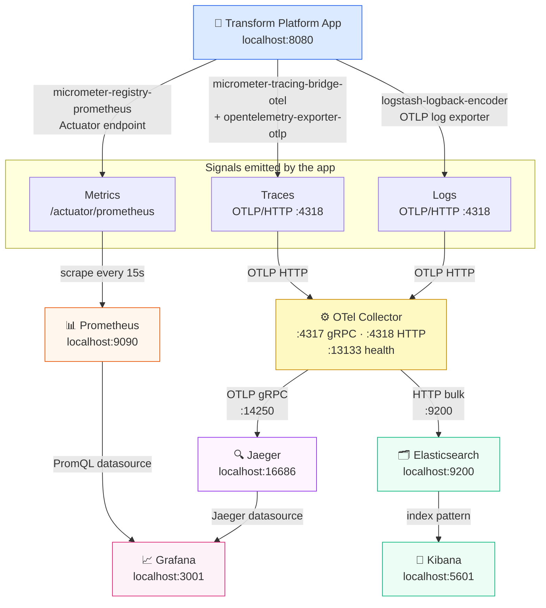
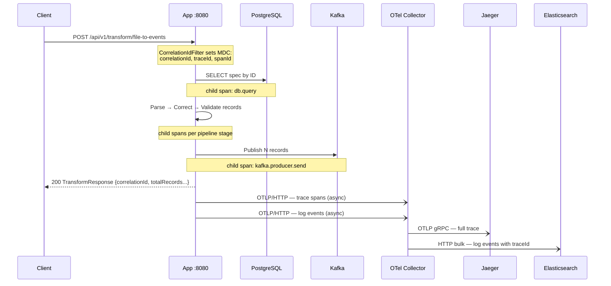
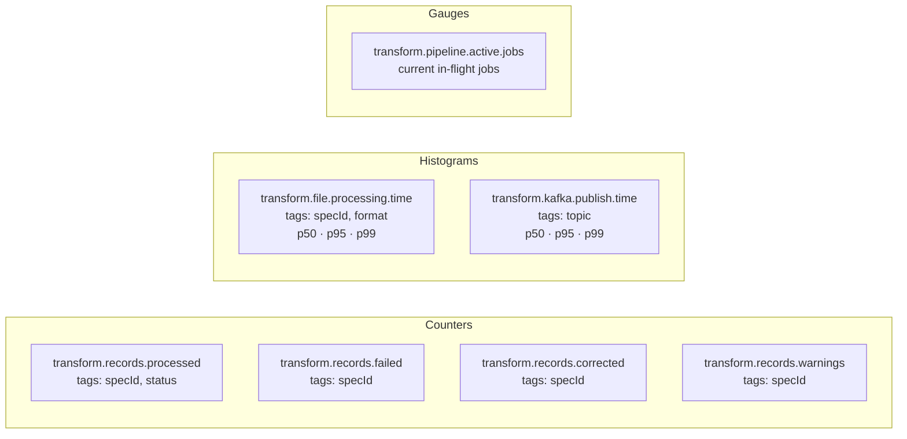
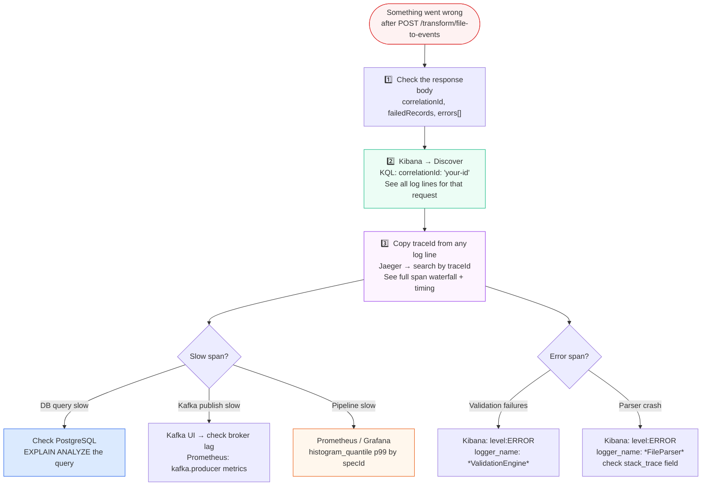

# Observability

Transform Platform ships a full observability stack out of the box. A single `docker compose up` gives you structured logs, distributed traces, and real-time metrics — all correlated by the same `traceId`.

---

## The Three Pillars



Every log line, every trace span, and every metric tag carries the same identifiers so you can jump between tools without losing context.

---

## Signal Flow — How Everything Connects



---

## Component Responsibilities

### App — what it emits

| Signal | Library | Transport | Destination |
|---|---|---|---|
| **Traces** | `micrometer-tracing-bridge-otel` + `opentelemetry-exporter-otlp` | OTLP/HTTP to `:4318` | OTel Collector |
| **Metrics** | `micrometer-registry-prometheus` | Actuator pull at `/actuator/prometheus` | Prometheus (scrapes every 15s) |
| **Logs** | `logstash-logback-encoder` via Logback `FILE` appender | Structured JSON file + OTel log exporter | OTel Collector → Elasticsearch |

Every HTTP request gets a `correlationId` injected into MDC by `CorrelationIdFilter`. Spring's OTel bridge then automatically adds the active `traceId` and `spanId` to MDC as well, so every log line carries all three identifiers.

### OTel Collector — the routing hub

The Collector (`:4318`) receives both traces and logs from the app over OTLP/HTTP. It:

- Routes **traces** → Jaeger via OTLP gRPC (`:14250`)
- Routes **logs** → Elasticsearch via HTTP bulk API (`:9200`)
- Exposes **its own metrics** at `:8889` (scraped by Prometheus)

Config: `.docker/otel-collector-config.yaml`

### Prometheus — metrics store

Prometheus pulls metrics from two sources every 15 seconds:

1. `/actuator/prometheus` on the app — all JVM + custom business metrics
2. `:8889` on the OTel Collector — collector pipeline metrics

Config: `.docker/prometheus.yml`

### Grafana — unified dashboard

Grafana connects to both Prometheus and Jaeger as datasources (auto-provisioned at startup). The pre-built **Transform Platform** dashboard correlates metrics and traces in one view. Config: `.docker/grafana/provisioning/`

### Elasticsearch + Kibana — log store

Structured JSON logs are forwarded from the OTel Collector to Elasticsearch. Kibana provides the search and visualisation layer. First-time setup requires creating a data view with pattern `transform-platform-*`.

---

## Trace Lifecycle — One Request End to End



Every span in Jaeger links back to the same `traceId` present in every log line. This means you can:

1. Find an error in **Kibana** → copy `traceId`
2. Paste into **Jaeger** search → see exactly which span failed and how long each step took
3. Switch to **Grafana** → view the metrics spike that coincided with the error

---

## Metrics Reference

All custom metrics are registered in `TransformMetrics.kt` using Micrometer. Tags enable per-spec filtering in Prometheus and Grafana.



### Key PromQL queries

```promql
# Throughput — records processed per minute (last 5m)
rate(transform_records_processed_total[5m]) * 60

# Error rate — failed as a percentage of total
rate(transform_records_failed_total[5m])
  / rate(transform_records_processed_total[5m])

# p99 processing time per spec
histogram_quantile(0.99,
  sum by(specId, le)(
    rate(transform_file_processing_duration_seconds_bucket[5m])
  )
)

# Specs with the most failures in the last hour
topk(5,
  sum by(specId)(increase(transform_records_failed_total[1h]))
)
```

---

## Log Structure

Every log line is emitted as JSON (when `dev-text` profile is not active). Fields injected automatically:

```json
{
  "@timestamp":    "2025-01-15T14:32:01.123Z",
  "level":         "ERROR",
  "logger_name":   "com.transformplatform.core.pipeline.TransformationPipeline",
  "message":       "Pipeline execution failed for spec=abc-123",
  "traceId":       "4bf92f3577b34da6a3ce929d0e0e4736",
  "spanId":        "00f067aa0ba902b7",
  "correlationId": "req-7f3a9c12",
  "thread_name":   "virtual-23",
  "stack_trace":   "com.transformplatform..."
}
```

`correlationId` is set per-request by `CorrelationIdFilter` (from `X-Correlation-ID` header or auto-generated UUID).
`traceId` and `spanId` are set automatically by Spring's OTel bridge from the active trace context.

---

## Developer Workflow — Debugging a Failed Transform

This is the recommended workflow when a transform job produces unexpected results or errors.



---

## Accessing the Tools

| Tool | URL | First steps |
|---|---|---|
| **Swagger UI** | http://localhost:8080/swagger-ui | Open in browser — no setup |
| **Actuator health** | http://localhost:8080/actuator/health | Open in browser or Postman |
| **Kafka UI** | http://localhost:8090 | Open in browser — browse topics and messages |
| **Prometheus** | http://localhost:9090 | Paste PromQL into the Expression bar → Execute |
| **Grafana** | http://localhost:3001 | Login `admin`/`admin` → Dashboards → Transform Platform |
| **Jaeger** | http://localhost:16686 | Select service `transform-platform` → Find Traces |
| **Kibana** | http://localhost:5601 | First visit: create data view `transform-platform-*` |

See `.docker/README.md` for detailed connection instructions, credentials, CLI commands, and troubleshooting.

---

## Configuration Files

| File | Purpose |
|---|---|
| `.docker/docker-compose.yml` | Defines all services, ports, and volumes |
| `.docker/otel-collector-config.yaml` | OTel Collector pipeline — receivers, processors, exporters |
| `.docker/prometheus.yml` | Prometheus scrape config — targets and intervals |
| `.docker/grafana/provisioning/datasources.yml` | Auto-provisions Prometheus + Jaeger datasources |
| `.docker/grafana/dashboards/transform-platform.json` | Pre-built Grafana dashboard |
| `platform-api/src/main/resources/logback-spring.xml` | Logback config — JSON appender + rolling file |
| `platform-api/src/main/resources/application.yml` | OTLP exporter endpoint, tracing sample rate |
| `platform-api/src/main/kotlin/.../metrics/TransformMetrics.kt` | All custom Micrometer meters |
| `platform-api/src/main/kotlin/.../filter/CorrelationIdFilter.kt` | Injects `correlationId` into MDC per request |
| `platform-api/src/main/kotlin/.../config/ObservabilityConfig.kt` | Global meter tags — service name, environment |
