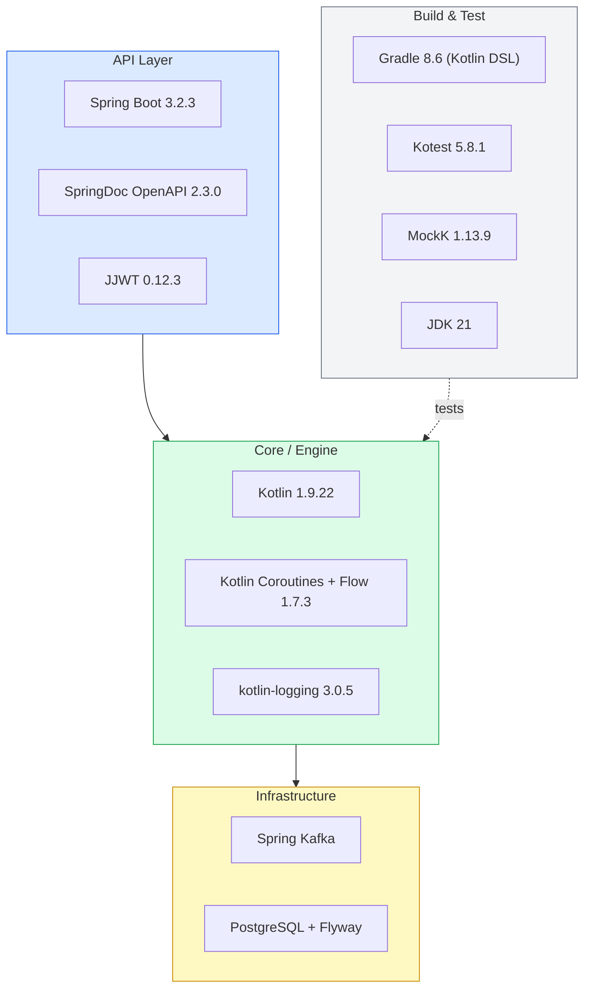
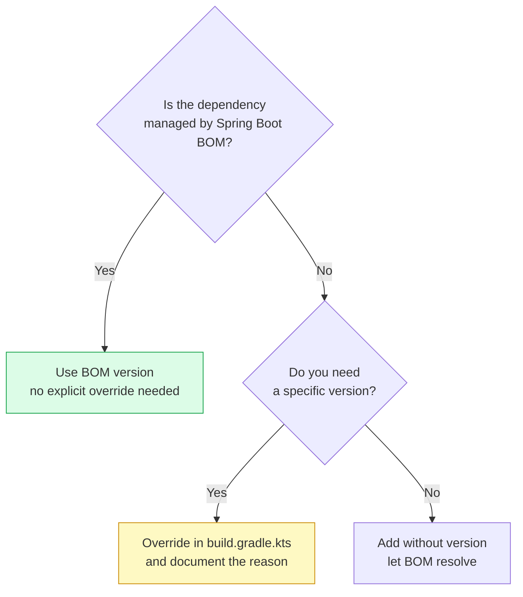
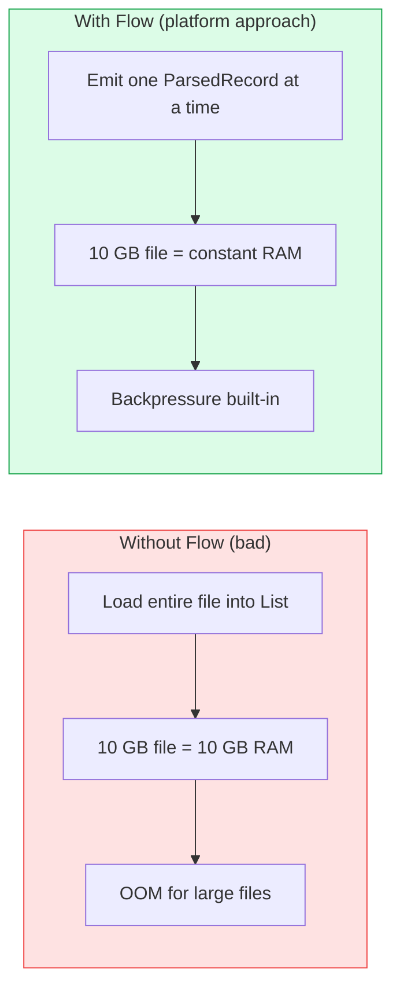

# Tech Stack

## Technology Layers

## Version Table

| Concern | Choice | Version |
|---------|--------|---------|
| Language | Kotlin | 1.9.22 |
| Runtime | JDK | 21 |
| Framework | Spring Boot | 3.2.3 |
| Build | Gradle (Kotlin DSL) | 8.6 |
| Streaming | Kotlin Coroutines / Flow | 1.7.3 |
| Messaging | Spring Kafka | *(managed by Boot BOM)* |
| Database | PostgreSQL + Flyway | *(managed by Boot BOM)* |
| API Docs | SpringDoc OpenAPI | 2.3.0 |
| Auth | JJWT | 0.12.3 |
| Testing | Kotest | 5.8.1 |
| Mocking | MockK | 1.13.9 |
| Logging | kotlin-logging (mu) | 3.0.5 |

## Dependency Version Policy

:::danger Common Pitfall
Never add `flyway-database-postgresql` as a dependency. It does not exist in Flyway 9.x (managed by Boot 3.2.3 BOM). `flyway-core` is sufficient.
:::

## Why Kotlin Coroutines + Flow?

